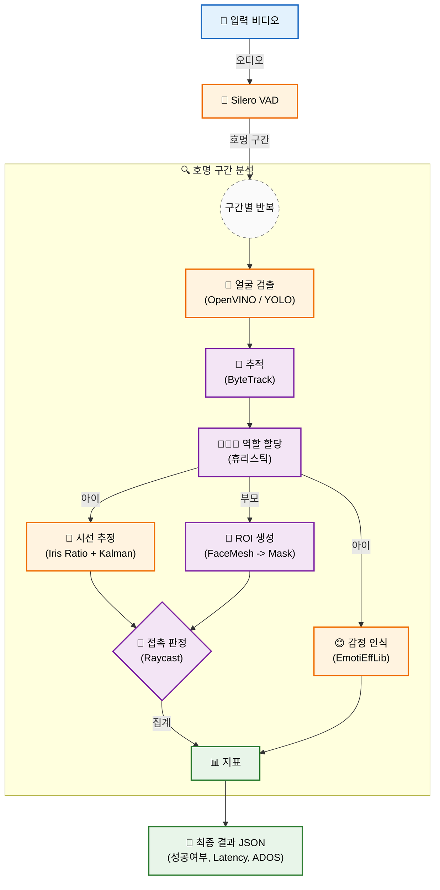
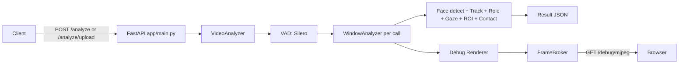

# 👶 Face-to-Face Name Response (RTN)
> **Multi-Model Inference Pipeline**

호명(부모 발화) 이후 **아이가 부모의 눈(eye ROI)을 바라보는지(eye-contact)** 를 영상에서 추정하는 **추론 파이프라인**입니다.

- ✅ **학습(Training) 없음**: 여러 사전학습/오픈 모델 + 기하학적 로직(휴리스틱)을 **순차적으로** 실행
- ✅ 입력: 동영상(`mp4/mov/avi/mkv/webm`)
- ✅ 출력: 시도별 성공 여부/반응 지연(latency)/시선 유지 시간(gaze duration) + 요약 지표(JSON)
- ✅ 제공 형태:
  - FastAPI 서비스 (`/analyze`, `/analyze/upload`, `/debug/mjpeg`)
  - RabbitMQ 워커 (`app/worker.py`) — 비동기 분석 파이프라인에 연결 가능

> [!WARNING]
> 이 프로젝트는 **연구/개발 목적**의 베이스라인입니다. 의료 진단/치료 결정을 위한 도구로 사용하려면 별도의 검증/인허가/품질관리 체계가 필요합니다.

---

## 🔄 Overall Structure



### Service Flow (Debug Stream)

- 분석 중 생성되는 디버그 프레임(overlay)을 **MJPEG** 로 브라우저에서 확인할 수 있습니다.



## 📦 What this repo does

이 레포는 “호명 반응(이름 부르기) 이후 아이가 부모를 바라봤는지”를 추정하기 위해,

1) **오디오에서 호명 후보 구간을 찾고(VAD)**
2) 각 구간의 **call_end 이후 일정 윈도우(기본 5초)** 에서
3) **얼굴 검출 → 추적 → (부모/아이) 역할 할당 → 아이 시선 벡터 추정 → 부모 눈 ROI 마스크 생성 → raycast 접촉 판정**
4) 결과를 **시도별(per_call) + 요약(summary) + ADOS 파생 지표(ADOS)** 로 반환합니다.

핵심은 **단일 모델**이 아니라, 여러 컴포넌트가 **입출력 계약(schema)** 으로 연결된 **멀티모델 추론 파이프라인**이라는 점입니다.

---

## Table of Contents

- [Overall Structure](#overall-structure)
- [What this repo does](#what-this-repo-does)
- [Quickstart](#quickstart)
- [Models (Inventory)](#models-inventory)
- [API](#api)
- [RabbitMQ Worker](#rabbitmq-worker)
- [Outputs (Schema)](#outputs-schema)
- [Configuration & Tuning](#configuration--tuning)
- [Debugging & Observability](#debugging--observability)
- [Performance notes](#performance-notes)
- [Project structure](#project-structure)
- [Tests](#tests)
- [Known limitations & recording tips](#known-limitations--recording-tips)
- [Docs](#docs)
- [License](#license)

---

## ⚡ Quickstart

### Prerequisites

- Python **3.11**
- **ffmpeg** (VAD 단계에서 영상에서 오디오 추출에 필요)
  - macOS: `brew install ffmpeg`
  - Ubuntu: `sudo apt-get update && sudo apt-get install -y ffmpeg`

### Local (Conda)

#### 1) 환경 구성

```bash
# repo root
conda env create -f environment.yml
conda activate face_to_face_name_response
pip install -r requirements.txt
```

> `setup_face_to_face_name_response.sh/.bat` 스크립트로도 설치할 수 있습니다.


#### Dependency notes (중요)

> [!IMPORTANT]
> **하드웨어 타겟**: 본 서비스는 **Intel Xeon CPU** 서버 환경에서의 효율적인 동작을 목표로 최적화되었습니다 (GPU 불필요).  
> 이에 따라 얼굴 검출에 **OpenVINO**를 기본값으로 사용합니다.

- **CPU Only**: 이 파이프라인은 기본적으로 CPU에서 동작합니다.
- **PyTorch**: `requirements.txt`에는 호환성을 위해 `--extra-index-url ...cu126`가 포함되어 있어, 환경에 따라 **CUDA 휠**이 설치될 수 있습니다.
  - CPU 전용으로 설치하려면 `--extra-index-url` 라인을 제거하고 공식 CPU 휠 인덱스를 사용하세요.
- **Emotion**: `EmotiEffLib` 또는 `hsemotion` 계열 라이브러리에 의존합니다. 설치/환경 문제로 import 실패 시 **자동으로 비활성화**됩니다.
  
> [!NOTE]
> 현재 `requirements.txt`에는 중복된 블록이 있어도 pip 설치는 보통 동작하지만, 오픈소스 배포 관점에서는 한 번 정리하는 것을 권장합니다.


#### 2) 서버 실행

```bash
# 편의 스크립트 실행 (conda run 포함)
./run_server.sh  # Windows: run_server.bat

# 또는 직접 실행
uvicorn app.main:app --reload --host 0.0.0.0 --port 8005
```

- Swagger UI: `http://localhost:8005/docs`
- Debug MJPEG: `http://localhost:8005/debug/mjpeg`

### Docker

Docker 이미지에는 ffmpeg가 포함됩니다.

```bash
docker build -t rtn-eyecontact .
docker run --rm -p 8000:8000 rtn-eyecontact
# http://localhost:8000/docs
# http://localhost:8000/debug/mjpeg
```

### 10초 체크 (API 호출)

```bash
curl -X POST "http://localhost:8005/analyze/upload" \
  -H "accept: application/json" \
  -F "file=@sample.mp4"
```

---


---

## 🧩 Models (Inventory)

> 아래 구성 요소를 조합해 추론합니다.

| Component | Role | Implementation | Where | Notes |
|---|---|---|---|---|
| Silero VAD | 음성 발화 구간 검출 | `snakers4/silero-vad` (PyTorch) | `app/rtn/audio/` | 영상에서 wav 추출에 ffmpeg 필요 |
| Face Detector | 얼굴 검출 | 기본: **OpenVINO ONNX** / 대안: ONNXRuntime / MediaPipe | `app/rtn/vision/` | `app/assets/models/yolov11n-face.onnx` 포함 |
| Tracking | 얼굴 ID 유지 | ByteTrack | `app/rtn/tracking/byte_tracker.py` | 검출 흔들림/교차에 강함 |
| FaceMesh + Iris | 얼굴 랜드마크(478) + 홍채 | MediaPipe | `app/rtn/vision/mp_facemesh.py` | 아이 시선 추정에 사용 |
| Gaze estimator | 2D 시선 벡터 | Iris ratio + smoothing | `app/rtn/gaze/iris_ratio.py` | 필터(EMA/Kalman) 포함 |
| Parent ROI | 부모 눈 ROI 마스크 | mesh 기반 + bbox fallback | `app/rtn/roi/parent_eye_roi.py` | mesh 실패 시에도 동작 |
| Contact judge | 시선-ROI 접촉 | raycast sampling | `app/rtn/roi/contact.py` | `min_contact_frames`로 스파이크 억제 |
| Emotion (optional) | 아이 표정(8 classes) | EmotiEffLib / HSEmotion | `app/rtn/emotion/` | CPU 비용이 있어 `skip_frames`로 제어 |

### Face detector 선택

현재 기본값은 **OpenVINO** 기반 얼굴 검출입니다.

- 설정 위치: `app/rtn/config.py → FaceDetConfig.model_selection`
  - `0`: MediaPipe FaceDetection
  - `1`: YOLO (ONNXRuntime)
  - `2`: OpenVINO (ONNX 직접 로드)

> 참고: `build_analyzer()`가 `FaceDetConfig(min_conf=conf)`만 생성하므로, detector를 바꾸려면 `FaceDetConfig` 기본값을 변경하거나 `build_analyzer()`를 확장하는 방식이 필요합니다.

---

## 🔌 API

### Endpoints

- `GET /docs` : Swagger UI
- `GET /health` : health check
- `POST /analyze` : 서버 로컬 경로 영상 분석(JSON body)
- `POST /analyze/upload` : 파일 업로드 분석(multipart)
- `GET /debug/mjpeg` : 최신 디버그 프레임 MJPEG 스트림(브라우저)

### Example: upload analyze

```bash
curl -X POST "http://localhost:8005/analyze/upload" \
  -H "accept: application/json" \
  -F "file=@sample.mp4"
```

### Example: local path analyze

```bash
curl -X POST "http://localhost:8005/analyze" \
  -H "content-type: application/json" \
  -d '{"video_path":"/absolute/path/to/sample.mp4"}'
```

---

## 🐇 RabbitMQ Worker

FastAPI가 아닌 **비동기 파이프라인**(예: 백엔드 오케스트레이터 → RabbitMQ → AI 워커)로 붙이고 싶다면 `app/worker.py` 를 사용합니다.

### Run worker

```bash
python -m app.worker
```

### Queue config (기본값)

`app/rtn/config.py → RabbitMQConfig`

- task queue: `analysis.req.task3`
- result queue: `analysis.resp`
- host: `rabbitmq` (Docker/Compose 환경을 가정)

> 현재는 환경변수 로딩이 아니라 dataclass 기본값을 사용합니다. 운영 환경에서는 config 로딩(ENV/Pydantic) 방식으로 확장하는 것을 권장합니다.

### Input message (task)

워커는 아래 중 하나로 비디오를 로드합니다.

1) `video_path` (로컬 경로)
2) `s3Uri` (presigned URL 포함, http로 시작하면 다운로드)
3) `video_base64` (레거시)

예시:

```json
{
  "examId": "...",
  "videoId": "...",
  "videoType": "NAME_FACING",
  "s3Uri": "https://...presigned...",
  "childName": "...",
  "ageMonths": 18
}
```

### Output message (result)

```json
{
  "examId": "...",
  "videoId": "...",
  "videoType": "NAME_FACING",
  "analyzedAt": "2026-02-13T12:34:56+09:00",
  "status": "SUCCESS",
  "metrics": {
    "per_trial": [
      {
        "trial_index": 1,
        "trial_start_s": 0.0,
        "trial_end_s": 0.67,
        "success": false,
        "latency_s": null,
        "gaze_duration_s": 0.0,
        "emotion": "Neutral"
      }
    ]
  },
  "ADOS": {"B1": 1, "B4": 3, "B6": false, "B18": true}
}
```

---

## 📄 Outputs (Schema)

서비스(`/analyze`, `/analyze/upload`)의 기본 응답은 다음 형태입니다.

```json
{
  "video": "sample.mp4",
  "params": {
    "window_s": 5.0,
    "vad_merge_gap_s": 0.3,
    "vad_min_speech_ms": 250,
    "vad_min_silence_ms": 250,
    "min_contact_frames": 3,
    "warmup_s": 1.0,
    "face_det_conf_th": 0.6
  },
  "summary": {
    "success_count": 4,
    "total_call_count": 5,
    "avg_latency_s": 1.45,
    "total_gaze_duration_s": 0.93
  },
  "ADOS": {
    "B1": 3,
    "B4": 1,
    "B6": true,
    "B18": true
  },
  "per_call": [
    {
      "call_index": 1,
      "call_start_s": 0.0,
      "call_end_s": 0.67,
      "success": false,
      "latency_s": null,
      "gaze_duration_s": 0.0,
      "dominant_emotion": "Neutral",
      "emotion_distribution": {"Neutral": 0.7, "Happiness": 0.1},
      "directional_emotions": ["Happiness"],
      "has_happiness": false
    }
  ]
}
```

### Metric definitions

- `success`: window 내 eye-contact 성공 여부
- `latency_s`: `call_end` 이후 **첫 eye-contact 확정**까지의 시간
- `gaze_duration_s`: window 기간 동안 contact=True로 판정된 프레임들의 `dt` 누적합
- `success_count / total_call_count`: VAD로 검출된 call 구간 중 성공 횟수

### ADOS mapping (현재 구현)

`app/rtn/pipeline/video_analyzer.py`에서 per_call 결과를 단순 규칙으로 파생합니다.

- `B1`: eye-contact 성공 횟수 기반(최대 3으로 cap)
- `B4`: contact 중 관측된 감정 다양성(Neutral 제외) 기반 점수
- `B6`: Happiness가 1회라도 관측되면 True
- `B18`: 성공이 1회라도 있으면 True

> ADOS는 원래 임상 스코어링이므로, 이 값은 **연구용 파생 지표**로 취급하는 것을 권장합니다.

---

## ⚙️ Configuration & Tuning

분석 파라미터는 `build_engine()` 인자로 조절합니다.

- 위치: `app/rtn/service/engine.py`
- 사용: `app/main.py` / `app/worker.py`

### 자주 만지는 파라미터

| Parameter | Meaning | Default | Impact |
|---|---|---:|---|
| `window_s` | call_end 이후 관찰 윈도우 길이 | 5.0 | 너무 짧으면 FN, 너무 길면 FP/비용 증가 |
| `warmup_s` | 역할 할당(warmup) 시간 | 1.0 | 짧으면 role swap ↑, 길면 초기 지연 ↑ |
| `min_contact_frames` | 성공 판정 최소 연속 프레임 | 3 | 스파이크 FP 억제 vs 반응 민감도 |
| `conf` | 얼굴 검출 임계 | 0.6 | 낮으면 FP↑, 높으면 FN↑ |
| `fps_override` | FPS 강제 | None | 메타데이터 FPS가 0/비정상일 때 유용 |
| `emotion_enable` | 감정 추론 on/off | True | CPU 비용 고려 |
| `emotion_skip_frames` | 감정 추론 프레임 간격 | 5 | 클수록 빠름/거칠어짐 |
| `emotion_model` | 감정 모델명 | enet_b0_8_best_vgaf | EmotiEffLib/HSEmotion model name |
| `enable_mjpeg` | MJPEG debug 스트림 | True | 운영에서 off 권장(비용/보안) |
| `jpeg_quality` | MJPEG 품질 | 80 | 대역폭/CPU와 트레이드오프 |

### Example: debug 스트림 끄기

`app/main.py`에서:

```python
engine, debug_router = build_engine(enable_mjpeg=False, debug=False)
```

---

## 🐞 Debugging & Observability

### 1) MJPEG Debug Stream

- `GET /debug/mjpeg`
- overlay에 다음이 표시됩니다.
  - track bbox + id
  - role assigned 여부 / parent(P), child(C)
  - parent eye ROI mask + hull
  - child iris landmarks
  - gaze ray(start → end)
  - contact 상태
  - (optional) child emotion

### 2) 로컬 창 디버그(OpenCV)

`build_engine(debug=True)`로 켜면 로컬에서 `cv2.imshow()` 기반 디버그를 볼 수 있습니다.

### 3) 흔한 실패 원인 체크리스트

- role 미할당: warmup 구간에 2명 트랙이 안정적으로 잡히는지
- tracking lost: 얼굴이 가려지거나 프레임 흔들림이 큰지
- child facemesh 실패: 측면/저해상도/눈 영역 가림
- ROI fallback이 과도하게 큼/작음: parent mesh 실패가 잦은지

---

## 🚀 Performance notes

- VAD는 영상에서 오디오를 추출하므로 **디스크 I/O** 가 발생합니다.
- end-to-end 비용은 대체로 다음에서 결정됩니다.
  - 얼굴 검출(프레임 수 × 모델)
  - FaceMesh(아이/부모 각 1회씩)
  - Emotion(딥러닝; enable/skip_frames에 의존)

튜닝 팁:
- `emotion_enable=False`로 먼저 안정화 후 켜기
- `emotion_skip_frames`를 키워 CPU 점유율 낮추기
- `fps_override` 또는 프레임 샘플링(추가 구현)으로 연산량 제어
- Face detector를 OpenVINO로 두면 CPU에서 대체로 유리

### 🛠️ Troubleshooting
VAD와 FaceMesh는 다수의 워커 실행 시 메모리를 많이 소모할 수 있습니다.
- **메모리 부족 시**: `VADConfig`의 `tmp_dirname`이 디스크 I/O를 유발하므로, 고속 SSD 사용을 권장합니다. 다중 워커 실행 시 RAM 용량을 고려하세요.

### 🎥 입력 비디오 권장 사양
- **권장 입력**: 720p (1280x720) 해상도, 30fps, H.264 코덱. (4K 영상은 처리 시간이 길어질 수 있습니다.)

---

## 📂 Project structure

```text
.
├─ app/
│  ├─ main.py                 # FastAPI entry
│  ├─ worker.py               # RabbitMQ consumer
│  ├─ assets/models/          # ONNX model(s) (yolov11n-face.onnx)
│  └─ rtn/
│     ├─ audio/               # ffmpeg + Silero VAD
│     ├─ vision/              # MediaPipe / YOLO / OpenVINO detector + FaceMesh
│     ├─ tracking/            # ByteTrack
│     ├─ pipeline/            # VideoAnalyzer / WindowAnalyzer / roles
│     ├─ gaze/                # iris ratio + smoothing
│     ├─ roi/                 # parent eye ROI + contact
│     ├─ emotion/             # EmotiEffLib/HSEmotion wrapper
│     └─ service/             # engine + debug stream
├─ docs/                      # 기술 문서/다이어그램
├─ baseline_analysis/         # 개선 리포트/실험 기록
└─ tests/                     # unit tests
```


## Extension points (이어 개발할 때 여기부터)

이 레포는 **단일 End-to-End 모델**이 아니라, 단계별 모듈을 교체할 수 있게 구성돼 있습니다.

- **호명 검출 고도화**: `app/rtn/audio/` (VAD → KWS/ASR로 확장)
- **얼굴 검출기 교체**: `app/rtn/vision/` (`OpenVINOFaceDetector`, `YOLOFaceDetector`, `FaceDetectorMP`)
- **추적기 교체/튜닝**: `app/rtn/tracking/byte_tracker.py`
- **부모/아이 역할 할당 개선**: `app/rtn/pipeline/roles.py`
- **시선 추정 개선**: `app/rtn/gaze/iris_ratio.py` (필터/3D head pose 결합 등)
- **ROI 생성 로직 개선**: `app/rtn/roi/parent_eye_roi.py`
- **접촉 판정 개선**: `app/rtn/roi/contact.py` (raycast 샘플링/임계값)
- **감정 추론 교체**: `app/rtn/emotion/emotion_recognizer.py` (모델/프레임 샘플링)

파이프라인 진입점은 다음 두 곳입니다.

- 서비스: `app/main.py` → `build_engine()` → `VideoAnalyzer.analyze()`
- 워커: `app/worker.py` → `build_engine(...enable_mjpeg=False...)` → `VideoAnalyzer.analyze()`


---

## Tests

현재 테스트는 `unittest` 기반입니다.

```bash
python -m unittest
```

특정 테스트만:

```bash
python -m unittest tests.test_worker_msg
python -m unittest tests.test_ados_scoring
```

---

## Known limitations & recording tips

### Known limitations

- Role assignment가 휴리스틱(면적/높이) 기반이라 **원근 역전**에 취약할 수 있습니다.
- FaceMesh/Iris는 **측면/가림/저해상도**에서 실패할 수 있습니다.
- 2D gaze baseline이라 **head pose/카메라 왜곡**에 민감합니다.
- VAD는 “이름”을 직접 인식하지 않고 speech 전체를 잡습니다(키워드 스팟팅/ASR 미포함).

### Recording tips (데이터 품질)

- 부모/아이 얼굴이 프레임 중앙에 잘 들어오게
- 조명 균일(눈 주변 그림자 최소)
- 얼굴 가림(손/장난감) 최소
- 카메라 흔들림 최소(트래킹 안정성)

---

## Docs

- 모델/알고리즘 상세(베이스라인): `docs/model_baseline.md`
- 구현 명세(스펙): `docs/model_implementation_detail.md`
- 감정 추론 스펙: `docs/emotion_extraction_spec.md`
- 개선 리포트: `baseline_analysis/`

---


## ❓ Troubleshooting

| 문제 (Symptom) | 해결 (Solution) |
| :--- | :--- |
| **ffmpeg not found** / 오디오 추출 실패 | 로컬에 `ffmpeg` 설치 (VAD는 wav 추출 필수)<br>Docker 사용 시 이미지 포함됨 |
| **OpenVINO not found** / 초기화 에러 | `pip install openvino`<br>또는 config에서 `model_selection=1` (YOLO) 또는 `0` (MediaPipe)로 변경 |
| **Emotion 모델 동작 안함** | `pip install EmotiEffLib` (또는 `hsemotion`)<br>설치 불가 시 `config.emotion_enable=False` 설정 |
| **MediaPipe 설치 에러** | Python 3.11 환경 권장<br>`mediapipe==0.10.14` 버전 고정 설치 |
| **메모리 부족 (OOM)** | `VADConfig.tmp_dirname` 디스크 I/O 확인 (SSD 권장)<br>다중 워커 실행 시 RAM 용량 확보 필요 |

## 🤝 Contributing

- 버그/개선 제안은 Issue로 남겨 주세요.
- PR을 올릴 때 권장 사항:
  - 변경 이유/재현 방법/전후 결과(가능하면 debug/mjpeg 캡처) 포함
  - `python -m unittest` 통과
  - 알고리즘 변경 시: `docs/model_baseline.md` 또는 `docs/model_implementation_detail.md`에도 함께 반영


## 📄 License

현재 이 프로젝트에는 라이선스 파일(`LICENSE`)이 포함되어 있지 않습니다.
별도의 라이선스 고지가 없는 한, 기본적으로 저작권법의 보호를 받습니다.

> 외부 모델 및 라이브러리(EmotiEffLib, HSEmotion 등) 사용 시에는 해당 라이선스 정책을 준수해야 합니다.
