# Face-to-Face Name Response: Model & Algorithm Implementation

본 문서는 `face-to-face-name-response` 서비스의 기술적 구현 세부 사항(모델 사양 및 알고리즘)을 정리한 기술 명세입니다.

---

## 1. 개요 (Overview)
호명(이름 부르기) 이후 아이가 부모의 눈 영역을 바라보는지(아이-컨택)를 분석. 고가의 장비나 대규모 학습 데이터 없이, 검증된 기초 AI 모델(MediaPipe, Silero)과 기하학적 로직을 결합하여 분석을 수행.

---

## 2. 전체 파이프라인 흐름 (High-level Pipeline)

분석 과정은 크게 음성 구간 검출(VAD)과 영상 분석(Vision)의 두 단계로 나뉘며, 호명 시점 이후 윈도우(기본 5초)를 관찰하는 구조.

1.  **VAD 단계**: 영상 전구간을 탐색하여 부모가 이름을 부르는 시점들을 찾아냄.
2.  **Tracking 단계**: 각 시점 이후 5초간 부모와 아이의 얼굴을 추적하고 ID를 고정.
3.  **Gaze/ROI 단계**: 아이의 시선 벡터와 부모의 눈 영역 ROI를 개별 추출.
4.  **Judging 단계**: 시선 벡터가 ROI 내부에 닿는지 프레임 단위로 판정.
5.  **Output 단계**: 설정된 임계값(기본 3프레임) 이상의 연속 접촉 시 성공으로 판정하고 반응 지연 시간을 계산.

---

## 3. 모듈별 세부 구현 (Technical Details)

### 3.1 음성 발화 구간 검출 (VAD)
- **모델**: `snakers4/silero-vad` (PyTorch 기반)
- **위치**: `app/rtn/audio/vad_silero.py`
- **입력 (Input)**: 16kHz 모노 오디오 스트림 (동영상에서 추출된 오디오)
- **출력 (Output)**: 발화 시작 및 종료 타임스탬프 리스트 (`list[tuple[float, float]]`)
- **구현 방식**:
    - **전처리**: 영상의 오디오를 31.25ms 단위로 split
    - **구간 검출**: `get_speech_timestamps`를 사용하여 호명 후보 구간을 특정
    - **최적화**: 싱글톤 패턴(`_SileroState`) 적용
- **한계점 (Limitations)**: 화자를 구분하지 못하며(Diarization 부재), 특정 키워드 인식(KWS) 없이 모든 목소리를 검출하여 오탐 발생 가능성 있음

### 3.2 얼굴 검출 및 특징점 추출 (Vision)
- **모델**: MediaPipe Face Detection & FaceMesh
- **위치**: `app/rtn/vision/`
- **입력 (Input)**: BGR 비디오 프레임 (이미지)
- **출력 (Output)**: 얼굴 랜드마크(478개 점) 및 바운딩 박스(BBox) 좌표
- **구현 방식**:
    - **이중 메쉬(Double Mesh)**: 연산 효율과 정확도를 위해 추적과 검출을 병행.
        - **추적 (`trk_mesh`)**: MediaPipe FaceMesh 모델을 활용해 이전 프레임의 정보를 바탕으로 관심 영역(ROI)을 좁혀 고속으로 특징점을 추정하며, 신뢰도(`min_tracking_confidence`)가 0.5 이상인 안정적인 상황에서 수행.
        - **검출 (`det_mesh`)**: 동일한 MediaPipe FaceMesh 모델을 사용하며, 추적 신뢰도가 임계값(`min_detection_confidence`, 0.5) 이하로 떨어지거나 초기화가 필요할 때 전체 영역을 재검색하여 위치를 보정하고 누적 오차를 제거.
    - **품질 보정**: 얼굴 주변을 정사각형으로 크롭하고, 저해상도 시 256px로 업스케일하여 홍채(Iris) 해상도를 확보
- **한계점 (Limitations)**: 저조도 환경이나 극심한 측면 얼굴에서 랜드마크 정확도가 급격히 저하되며, MediaPipe 모델의 기본 성능에 의존적임

### 3.3 ID 추적 및 역할 할당 (Tracking & Role)
- **알고리즘**: SORT (Simple Online and Realtime Tracking) & Area Heuristic
- **위치**: `app/rtn/tracking/`, `app/rtn/pipeline/roles.py`
- **입력 (Input)**: 검출된 박스 리스트 및 현재 프레임 시간
- **출력 (Output)**: 생존 중인 트랙 ID 및 역할 확정 결과 (부모 ID, 아이 ID)
- **구현 방식**:
    - **SORT**: Kalman Filter를 사용하여 얼굴 박스의 좌표와 속도를 상태 변수로 추정. 이전 프레임의 데이터를 기반으로 현재 위치를 예측(Predict)하고, 실제 검출된 박스와의 오차를 반영해 상태를 갱신(Update)함으로써 프레임 간 ID 일관성을 유지.
    - **자동 역할 할당**: `warmup_s`(1초) 동안의 평균 얼굴 면적을 비교하여 **큰 얼굴=부모, 작은 얼굴=아이**로 판별.
- **한계점 (Limitations)**: SORT는 가려짐(Occlusion)이 길어지면 ID를 놓칠 수 있으며, 면적 기반 할당은 원근법에 의한 역전 상황에 취약함

### 3.4 2D 시선 벡터 추정 (Gaze Estimation)
- **알고리즘**: Iris Ratio Method
- **위치**: `app/rtn/gaze/iris_ratio.py`
- **입력 (Input)**: 아이(Child)의 최신 얼굴 랜드마크 (눈 및 홍채 데이터)
- **출력 (Output)**: 정규화된 시선 방향 오프셋($dx, dy$) 및 화면상 벡터 끝점(End Point)
- **구현 방식**:
    - **상대 위치 계산**: 눈의 양 끝점(Corners)과 상하 특징점을 기준으로 홍채 중심의 위치 비율을 계산하여 시선 방향을 산출
    - **안정화 필터**: 시선 벡터의 노이즈 억제를 위해 3단계 필터링 체인을 적용
        - **Deadzone**: 특정 임계값 이하의 미세한 좌표 변화는 무시하여 정지 상태에서의 미세 떨림(Jitter)을 방지
        - **Jump Clamp**: 프레임 간 이동 거리가 물리적 한계를 초과하는 경우, 최대 이동 거리를 제한하여 튀는 현상을 차단
        - **Alpha Filter**: 지수 이동 평균(EMA)을 활용하여 이전 데이터와 현재 데이터의 가중치를 조절함으로써 시선 궤적을 부드럽게 평활화
- **한계점 (Limitations)**: 2D 기하학 기반이므로 머리 회전(Pose) 시 오차가 크며, 필터 적용으로 인해 급격한 시선 이동 시 반응 지연(Lag)이 미세하게 발생함

### 3.5 접촉 판별 및 성공 요건 (Contact & Success)
- **알고리즘**: 2D Raycasting & ROI Fallback
- **위치**: `app/rtn/roi/`, `app/rtn/pipeline/window_analyzer.py`
- **입력 (Input)**: 아이의 시선 벡터 + 부모의 눈 영역 마스크(ROI Mask)
- **출력 (Output)**: 프레임별 접촉 여부(Boolean), 시도시별 성공 여부 및 지연 시간(latency)
- **구현 방식**:
    - **Dynamic ROI Mask**: 부모의 눈 주변 특징점을 `Convex Hull`로 연결하여 마스크를 생성하며, 랜드마크 검출 실패 시 BBox 상단 영역에 타원형 ROI를 설정하는 Fallback 로직을 적용
    - **Raycasting**: 아이의 눈 위치에서 시선 벡터를 따라 일정 간격으로 샘플링 지점(Sampling Points)들을 배치하고, 해당 지점들이 부모의 ROI 마스크 내부에 포함되는지 검사하여 충돌 여부를 판정
    - **최종 판정**: 설정된 임계값(기본 3프레임, 가변 설정 가능) 이상의 연속 접촉이 발생할 경우 '성공'으로 최종 확정하며, 호명 종료 시점부터 첫 접촉 시점까지의 간격을 반응 지연 시간(Latency)으로 계산
- **한계점 (Limitations)**: 랜드마크 실패 시의 BBox Fallback ROI는 정밀도가 낮으며, 2D Raycasting 샘플링 간격에 따라 판정 오차가 존재할 수 있음

### 3.6 감정 인식 (Emotion Recognition)
- **모델**: `HSEmotion` / `EmotiEffLib` (EfficientNet-7 기반)
- **위치**: `app/rtn/emotion/`, `app/rtn/pipeline/window_analyzer.py`
- **입력 (Input)**: 아이(Child)의 최신 얼굴 크롭 이미지 (RGB 변환)
- **출력 (Output)**: 8가지 감정 확률 분포 (Anger, Contempt, Disgust, Fear, Happiness, Neutral, Sadness, Surprise) 및 주요 감정(Dominant Emotion)
- **구현 방식**:
    - **Downsampling**: 매 프레임 분석하지 않고 설정된 간격(`skip_frames`, 기본 5~30)마다 수행하여 CPU 부하 최소화
    - **Filtering**: 얼굴 크기가 일정 픽셀(`min_face_size`) 이상일 때만 분석하여 정확도 확보
    - **Aggregation**: 분석 윈도우(5초) 동안 수집된 감정 확률들을 평균내어 최종 감정 분포를 산출하고, 가장 높은 확률을 가진 감정을 선택
- **한계점 (Limitations)**: 딥러닝 모델 추론으로 인한 CPU 사용량 증가, 얼굴이 작거나 흔들릴 경우 정확도 저하

---

## 4. 주요 지표 (Output Metrics)
서비스는 각 호명 시도마다 아래의 데이터를 JSON 형태로 반환.

| 지표명 | 설명 | 비고 |
| :--- | :--- | :--- |
| **success** | 시선 맞춤 성공 여부 | 윈도우 내 연속 접촉 건수 도달 시 |
| **latency_s** | 반응 지연 시간 | `call_end` 시점부터 첫 접촉까지의 시간 |
| **gaze_duration_s** | 시선 유지 시간 | 윈도우 기간 내 총 접촉 시간의 합 |
| **dominant_emotion** | 주된 감정 상태 | 윈도우 내 평균 확률이 가장 높은 감정 (영문) |
| **emotion_distribution** | 감정 확률 분포 | 8개 감정별 확률값 (0.0~1.0) 딕셔너리 |
| **total_call_count** | 총 호명 시도 횟수 | VAD 검출 구간 합계 |

---
## 5. 성능 개선 로드맵 및 한계점 (Roadmap & Limitations)

현재 베이스라인 시스템은 CPU 환경에서의 효율성에 최적화되어 있으나, 특정 상황에서의 정확도 향상을 위해 아래와 같은 개선 경로를 가짐.

### 5.1 음성 분석 및 VAD (베이스라인: `Silero VAD`)
- **한계점**: 화자 미구분, 키워드 미인식, 주변 소음 취약성
- **개선 옵션**:
    - **RNNoise** `[CPU 가벼움]`: **(소음 보정)** `Silero VAD` 입력 오디오의 노이즈를 제거하여 발화 검출 정밀도 향상
    - **KWS (Keyword Spotting)** `[CPU 가벼움]`: **(오검출 개선)** 이름 감지 후 `Silero VAD` 구간을 필터링하여 False Positive 감소
    - **ASR (STT) 매칭** `[GPU 권장]`: **(유연성 개선)** `Silero VAD` 구간의 텍스트를 분석하여 다양한 호칭 및 문맥 파악
    - **화자 인증 (Speaker Verification)** `[GPU 권장]`: **(신뢰도 개선)** 부모 목소리 대조를 통해 `Silero VAD`가 잡은 아이 소리를 필터링

### 5.2 ID 추적 및 역할 할당 (베이스라인: `SORT`, `Area Heuristic`)
- **한계점**: 거리 역전에 따른 부모/아이 역할 뒤바뀜, 측면 얼굴 시 검출 누락
- **개선 옵션**:
    - **ByteTrack** `[CPU 가벼움]`: **(추적 강화)** `SORT` 대비 저신뢰도 검출 프레임에서도 ID를 끝까지 유지하여 단절 방지
    - **YOLOv11n-face** `[CPU 가능/ONNX]`: **(검출 개선)** `MP Face Detection` 대비 먼 거리 및 깊은 측면 얼굴 검출력 확보. v8보다 조금 더 유리한 부분 있음(CPU 연산량 감소, 먼 거리 검출력).
    - **수직 위치/골격 분석** `[기하 로직]`: **(보조 알고리즘)** `Area Heuristic`의 한계인 원근법에 의한 면적 역전(아이가 카메라에 더 가까워 얼굴이 크게 보이는 경우)을 보완하기 위해 Y좌표(높이) 및 IPD(양눈의 동공 사이의 거리) 비율을 활용한 역할 판정 보정
    - **연령 추정 (Age Estimation)** `[GPU 권장]`: **(역할 확정)** `Area Heuristic` 대신 인체 특징(Age)으로 성인/아동을 완벽히 분리

### 5.3 시선 추정 및 접촉 판정 (베이스라인: `Iris Ratio`, `Alpha Filter`)
- **한계점**: 고개 돌림 시 시선 오차 발생, 시선 벡터의 미세 떨림(Jitter)
- **개선 옵션**:
    - **Kalman Filter** `[CPU 가벼움]`: **(안정화 개선)** 속도 기반 예측으로 `Alpha Filter` 특유의 지연을 줄이고 떨림을 보정
    - **3D Head Pose / PnP** `[CPU 가능]`: **(기하 보정)** `Iris Ratio`가 계산한 2D 오프셋에 머리 회전 각도를 결합하여 3D 시선 벡터 산출
    - **학습 기반 Gaze 모델** `[GPU 필수적]`: **(정확도 향상)** `Iris Ratio` 대신 딥러닝 전용 모델을 도입하여 극한의 각도에서도 시선 추적 성공

### 5.4 감정 인식 (베이스라인: `HSEmotion-EN7`)
- **한계점**: CPU 연산 부하, 해상도 의존성
- **개선 옵션**:
    - **OpenVINO / ONNX Quantization** `[CPU 가속]`: **(속도 개선)** 모델 양자화를 통해 추론 속도 향상 및 CPU 점유율 감소
    - **Temporal Smoothing** `[로직 개선]`: **(안정성)** 단일 프레임 예측값이 아닌, 시계열 필터링을 적용하여 감정 변화의 연속성 보장
    - **Multimodal Fusion** `[GPU 권장]`: **(정확도 향상)** 얼굴 표정뿐만 아니라 아이의 음성(울음소리, 옹알이 톤)을 함께 분석하여 감정 판정 신뢰도 향상

---

## 6. 디버깅 및 관측성 (Observability)
- **MJPEG Debug Stream**: `/debug/mjpeg`를 통해 분석 과정(BBox, 시선 벡터, ROI 마스크 등)이 오버레이된 영상을 실시간 브라우저 모니터링 가능.
- **Log Metrics**: 각 단계별(Role 할당, 첫 접촉 시점 등) 상세 타임스탬프를 로그로 남겨 분석의 사후 검증이 용이.
