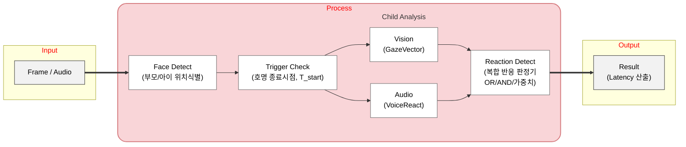
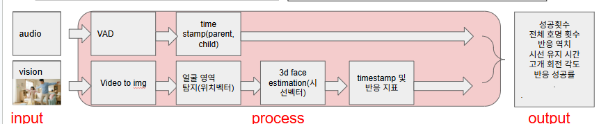
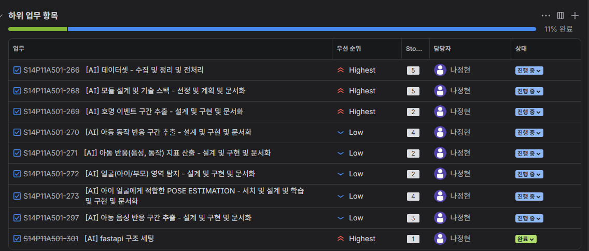

# 비대면 호명반응 분석

### 개요
>  아동의 시야 밖에서 제공된 청각 자극(이름 호명)에 대해, 신체 접촉이나 시각적 단서 없이 **행동적 반응**(고개 및 시선 방향을 전환하는 행동) 또는 **음성적 반응**이 있는지, 그 지표는 어떠한지를 분석하는 시스템. 


### 조작적 정의

| 지표                            | 설명                                            |
| ------------------------------- | ----------------------------------------------- |
| **시선 벡터 (Gaze Vector)**     | 양쪽 귀를 잇는 축에 직교하고 코를 통과하는 벡터 |
| **위치 벡터 (Position Vector)** | 부모 얼굴 영역 중심점 → 아이 얼굴 영역 중심점을 잇는 벡터 |
| **반응 지연 (Latency)**         | 부모가 부른 시점부터 아동이 최초의 음성적 또는 행동적 반응을 시작하기까지의 시간으로 정의         |
| **반응 유형**              | GAZE/VOICE/BOTH                   |
| **음성 반응 지연 시간**              | (반응이 있다면) 호명                   |
| **행동 반응 지연 시간**              | (반응이 있다면) 호명                   |
| **시선 유지 시간**              | (반응이 있다면) 부모를 바라보는 시선 지속 시간     |


### 목적

1. 시선 벡터와 위치 벡터 간의 지표를 산출하겠다.
2. 발화 자극과 행동 반응 사이의 지연 시간을 측정하겠다.
3. 발화 자극과 음성 반응 사이의 지연 시간을 측정하겠다.
4. 시선 유지 시간을 측정하겠다.

**→ 2/3/4 을 종합하여 지표를 산출하겠다.**


## 파이프라인 흐름도
- 전체 흐름: 입력 데이터 → 전처리(VAD/Face Det.) → 정밀 분석(STT/Mesh) → 후처리(Rule-base 알고리즘)
1. Vision Pipeline:
    - Input Video → MediaPipe Face Detection (얼굴 유무 확인) → MediaPipe Face Mesh (랜드마크 추출) → Custom Geometry Alg. (헤드 포즈 및 시선 계산) → 상호작용 데이터 생성

2. Audio Pipeline:
    - Input Audio → Silero VAD (무음 제거) → pyannote-audio (화자 A/B 분리) → OpenAI Whisper (텍스트 변환) → 대화 내용 및 패턴 분석


```
[Input] → [Face Detect] → [Trigger Check] → [Child Analysis] → [Reaction Detect] → [Result]
   │           │                │                  │                  │               │
   ▼           ▼                ▼                  ▼                  ▼               ▼
Frame/Audio  부모/아이      호명 종료시점     ┌── Vision ─┐          복합 반응          Latency
             위치식별       T_start 기록     │ GazeVector│           판정기             산출
                                           └───────────┘              ↓
                                           ┌─ Audio ───┐         OR/AND/가중치
                                           │ VoiceReact│     
                                           └───────────┘
```



1. **[Input]**
    - 프레임(Video) & 오디오 청크(Audio) 입력
2. **[Face Detect]**
    - 부모 / 아이 위치 식별
    - → Position Vector 생성
3. **[Trigger Check]**
    - 부모가 `이름`을 부르고 끝났는가?
    - → 호명 종료 시점 $T_{start}$ 기록
4. **[Child Analysis]**
    - (Vision) 아이의 고개 벡터 추출
        - → Gaze Vector 생성
    - (Audio) 아이 쪽에서 소리가 났는가?
5. **[Compare]**
    - Gaze Vector와 Position Vector의 각도 차이가 THRESHOLD도 이내인가?
    - **OR** 아이의 발화가 감지되었는가?
6. **[Result]**
    - 조건 만족 시 지표($T_{react}$ 기록 및 Latency 등), 모니터링 영상 산출
    - 조건 미만족시에도, 지표(NULL 값 허용)와 모니터링 영상 산출


# 기술 스택
### 1. 프레임워크
- python
- FastAPI
- Celery
- RabbitMQ

### 2. AI/ML
|                    | 라이브러리/모델          | 용도                         |
| ------------------ | ------------------------ | ---------------------------- |
| **얼굴 탐지**      | MediaPipe Face Detection | 부모/아이 얼굴 위치          |
| **얼굴 랜드마크**  | MediaPipe Face Mesh | 468개 랜드마크 (귀, 코 등)   |
| **Head Pose**      | MediaPipe + Custom | Yaw/Pitch/Roll 추정          |
| **화자 분리**      | pyannote-audio           | Speaker Diarization          |
| **음성 인식**      | OpenAI Whisper<br />Whisper Large-v3 | 호명 트리거 + 아이 발화 내용 |
| **음성 활동 탐지** | Silero VAD               | 아이 음성 반응 구간 탐지     |


### 2.2. 선정 근거

1. 얼굴 탐지
   - `MediaPipe Face Detection` : 
     - **강인함:** 다양한 조명 환경과 아이의 빠른 움직임에도 얼굴 영역(ROI)을 안정적으로 추적.
     - **효율성:** Face Mesh 전처리 단계로서, 얼굴이 있을 때만 무거운 연산을 수행하도록 트리거 역할 수행.
2. 얼굴 랜드마크
   - `MediaPipe Face Mesh` :
     - **정밀도:** 468개의 3D 얼굴 랜드마크를 추출하여 눈, 코, 입, 귀의 미세한 움직임 포착 가능.
     - **활용성:** 아이의 표정 변화(웃음, 찡그림)와 시선 방향을 분석하는 데 필수적인 기하학적 데이터 제공.
     - **Iris Tracking:** 동공 추적 기능이 포함되어 있어 아이의 시선 집중도(Attention) 분석 가능.
3. head pose
   - `MediaPipe + Custom`
     - **연산 효율:** 별도의 무거운 포즈 추정 모델 없이, Face Mesh에서 추출된 랜드마크 좌표를 기반으로 PnP(Perspective-n-Point) 알고리즘을 적용하여 Yaw/Pitch/Roll 계산.
     - **상호작용 분석:** 부모와 아이가 서로를 바라보는지(Eye-contact), 혹은 다른 곳을 보는지 3차원적 시선 교차 분석 가능.
4. 화자 분리
   - `pyannote-audio` : 
     - **SOTA 성능:** 현재 오픈소스 화자 분리(Speaker Diarization) 분야에서 가장 높은 성능을 보이는 라이브러리 중 하나.
     - **End-to-End 파이프라인:** 음성 구간 검출(VAD)부터 임베딩 추출, 클러스터링까지 일관된 파이프라인 제공.
     - **식별 능력:** 성인(부모)과 아동(아이)의 음성 주파수 특성을 효과적으로 분리하여 대화 점유율 분석 가능.
5. 음성 인식
   - `OpenAIWhisper` :
     - **노이즈 강인성:** 가정 내 생활 소음(TV 소리, 장난감 소리 등)이 있는 환경에서도 높은 인식률 보장.
     - **다국어/문맥 이해:** 한국어 음성 인식 성능이 우수하며, '호명(이름 부르기)'과 같은 짧은 발화도 문맥을 통해 정확히 텍스트로 변환.
     - **모델 유연성:** 하드웨어 사양에 따라 Tiny부터 Large 모델까지 선택적 적용 가능.
6. 음성 활동 탐지
   - `Silero VAD`
     - **초저지연(Low Latency):** 30ms 청크 단위 처리가 가능하여 실시간성이 매우 뛰어남.
     - **리소스 최적화:** 무거운 Whisper 모델을 항상 돌리지 않고, 사람의 목소리가 감지된 구간(Speech Segment)만 필터링하여 전달함으로써 서버/디바이스 부하를 획기적으로 감소시킴.


# 디렉토리 설명

```
name_non_facing/
├── app/
│   ├── __init__.py
│   ├── main.py                 # FastAPI 앱 진입점
│   ├── config.py               # 설정 및 환경변수
│   ├── worker.py               # Celery Worker
│   │
│   ├── api/                    # API 라우터
│   │   ├── __init__.py
│   │   ├── router.py
│   │   ├── endpoints/
│   │   │   ├── __init__.py
│   │   │   ├── analysis.py
│   │   │   └── health.py
│   │   └── schemas/
│   │       ├── __init__.py
│   │       ├── request.py
│   │       └── response.py    
│   │
│   ├── models/                 # AI 모델 래퍼
│   │   ├── __init__.py
│   │   ├── base.py
│   │   ├── face_detector.py
│   │   ├── face_mesh.py
│   │   ├── head_pose.py
│   │   ├── speech_recognizer.py
│   │   ├── speaker_diarizer.py
│   │   ├── vad.py
│   │   └── child_voice_analyzer.py  
│   │
│   ├── pipeline/               # 분석 파이프라인
│   │   ├── __init__.py
│   │   ├── orchestrator.py
│   │   ├── context.py
│   │   └── stages/
│   │       ├── __init__.py
│   │       ├── input_stage.py
│   │       ├── face_detect_stage.py
│   │       ├── trigger_stage.py
│   │       ├── child_analysis_stage.py
│   │       ├── reaction_detect_stage.py
│   │       └── result_stage.py
│   │
│   ├── core/                   # 핵심 비즈니스 로직
│   │   ├── __init__.py
│   │   ├── vector_math.py  
│   │   ├── angle_calculator.py 
│   │   ├── latency_tracker.py 
│   │   ├── trial_manager.py 
│   │   │
│   │   └── reaction/          
│   │       ├── __init__.py
│   │       ├── base.py        
│   │       ├── gaze_detector.py
│   │       ├── voice_detector.py
│   │       ├── composite.py    
│   │       ├── events.py
│   │       └── factory.py    
│   │
│   ├── utils/                  # 유틸리티
│   │   ├── __init__.py
│   │   ├── video.py            
│   │   ├── audio.py            
│   │   ├── visualize.py    
│   │   ├── time_sync.py        # 시간 동기화
│   │   └── logger.py           # 로깅 설정
│   │
│   └── services/               # 외부 서비스 연동
│       ├── __init__.py
│       └── rabbitmq.py        
│
├── docs/
├── test/
├── sample_video/
├── Dockerfile
├── docker-compose.yml
├── requirements.txt
├── requirements-dev.txt
└── README.md
```


## 필수 참고 이미지

파이프라인 시각화 : 
지라 업무 분할 : 

# 

# 설계 시 고려사항

2.1 전략

- 반응 판정 로직을 **교체 가능한 전략 객체**로 분리하여 새로운 판정 방식 추가 용이.

```
ReactionDetector (Interface)
    ├── GazeReactionDetector      # 시선 기반
    ├── VoiceReactionDetector     # 음성 기반
    ├── OrReactionDetector        # OR 조합 (default: 지금 사용. 나중에 언젠가... 가중치 고려 ...)
    ├── AndReactionDetector       # AND 조합
    └── WeightedReactionDetector  # 가중치 조합
```

2.2 이벤트 기반 아키텍처

각 분석 모듈이 **독립적으로 이벤트를 발행**하고, 반응 판정기가 이를 구독하여 처리.

```
GazeAnalyzer  ──publish──▶  GazeEvent{timestamp, angle, is_looking}
VoiceAnalyzer ──publish──▶  VoiceEvent{timestamp, duration, speaker}
                                    │
                                    ▼
                           ReactionAggregator (구독)
                                    │
                                    ▼
                           ReactionResult{type, latency, details}
```

```
┌─────────────────────────────────────────────────────────────────┐
│                    ChildAnalysisStage                           │
│  ┌─────────────────┐              ┌─────────────────┐           │
│  │  GazeAnalyzer   │              │  VoiceAnalyzer  │           │
│  │                 │              │                 │           │
│  │ frames ──────▶  │              │ audio ───────▶ │           │
│  │      GazeEvent  │              │      VoiceEvent │            │
│  └────────┬────────┘              └────────┬────────┘            │
│           │                                │                     │
│           ▼                                ▼                     │
│         gaze_events[]                 voice_events[]             │
└───────────┬───────────────────────────────┬──────────────────────┘
            │                               │
            ▼                               ▼
┌──────────────────────────────────────────────────────────────────┐
│                   ReactionDetectStage                            │
│                                                                  │
│  ┌──────────────────────────────────────────────────────────┐    │
│  │              ReactionDetector (OR Mode)                  │    │
│  │                                                          │    │
│  │   gaze_events ───▶ ┌─────────────┐                       │    │
│  │                     │ OR 판정     │ ───▶ ReactionResult  │    │
│  │  voice_events ───▶ └─────────────┘                       │    │
│  │                                                          │    │
│  └──────────────────────────────────────────────────────────┘    │
└──────────────────────────────────────────────────────────────────┘
```

2.3 플러그인 구조

- 새로운 반응 유형(예: 제스처, 표정) 추가 시 기존 코드 수정 없이 확장.

2.4 데이터 흐름

```
InputStage
    └─ video_path → frames[], audio_data

FaceDetectStage  
    └─ frames → face_detections{timestamp: [FaceDetection]}
    └─ → position_vectors{timestamp: Vector2D}
    └─ → speaker_mapping (초기 화자 매핑)

TriggerStage
    └─ audio_data → transcription → name_call_events[]
    └─ → trials[] 생성

ChildAnalysisStage 
    ├─ [Vision Path]
    │   └─ frames + face_detections → landmarks → head_poses → gaze_events[]
    │
    └─ [Audio Path]
        └─ audio_data + speaker_mapping → vad → child_voice_events[]

ReactionDetectStage
    └─ gaze_events + voice_events → ReactionDetector.detect()
    └─ → trial_reactions[] (통합 결과)

ResultStage
    └─ trial_reactions → AnalysisResponse (reaction_type 포함)
```


# 작업 내역
## 1. 오디오
### 1.1. 아키텍쳐
```
┌──────────────────────────────────────────────────────────────┐
│                   ChildVoiceAnalyzer                         │
│  (VAD + SpeakerDiarizer + SpeechRecognizer 통합)              │
├──────────────────────────────────────────────────────────────┤
│  VoiceActivityDetector  │  SpeakerDiarizer │ SpeechRecognizer│
│   (Silero VAD)          │  (pyannote)      │ (faster-whisper)│
├──────────────────────────────────────────────────────────────┤
│                     BaseModel (Singleton)                    │
├──────────────────────────────────────────────────────────────┤
│                     Settings (config.py)                     │
└──────────────────────────────────────────────────────────────┘
```
### 1.2. 오디오 파이프라인 구조
```
Input Audio
    │
    ▼
┌─────────────────────────────────────────────────────────────┐
│  1. Silero VAD (음성 활동 탐지)                              │
│     - 무음 구간 제거                                         │
│     - Speech Segment 추출                                    │
│     - 30ms 청크 단위 처리 (초저지연)                          │
└─────────────────────────────────────────────────────────────┘
    │
    ▼
┌─────────────────────────────────────────────────────────────┐
│  2. pyannote-audio (화자 분리)                               │
│     - Speaker A/B 분리                                       │
│     - 부모/아이 식별                                         │
└─────────────────────────────────────────────────────────────┘
    │
    ▼
┌─────────────────────────────────────────────────────────────┐
│  3. OpenAI Whisper (음성 인식)                               │
│     - STT (Speech-to-Text)                                   │
│     - 호명 트리거 탐지                                       │
│     - 아이 발화 내용 분석                                    │
└─────────────────────────────────────────────────────────────┘
    │
    ▼
Output: 화자별 발화 구간 + 텍스트 + 타임스탬프
```

### 시스템 아키텍쳐
```
비디오/오디오 입력
    ↓
┌─────────────────────────────────────────┐
│  1. Audio Extraction (FFmpeg)           │
│     - 비디오에서 오디오 추출              │
│     - 16kHz mono WAV 변환                │
└─────────────────────────────────────────┘
    ↓
┌─────────────────────────────────────────┐
│  2. Voice Activity Detection (VAD)      │
│     - Silero VAD 모델                    │
│     - 음성 구간 감지 (0.32-3.77s 등)     │
└─────────────────────────────────────────┘
    ↓
┌─────────────────────────────────────────┐
│  3. Speech Recognition                  │
│     - faster-whisper (large-v3)         │
│     - 한국어 음성 인식                    │
│     - 호명 이벤트 감지 ("정현" 등)        │
└─────────────────────────────────────────┘
    ↓
┌─────────────────────────────────────────┐
│  4. Speaker Diarization                 │
│     - pyannote-audio 3.1                │
│     - 화자별 구간 분리 (SPEAKER_00 등)   │
└─────────────────────────────────────────┘
    ↓
┌─────────────────────────────────────────┐
│  5. Child Voice Analysis                │
│     - 호명 후 아이 음성 반응 구간 추출    │
│     - Latency 계산 (호명 끝 ~ 반응 시작)  │
│     - Duration 계산 (반응 지속 시간)      │
└─────────────────────────────────────────┘
    ↓
반응 구간 결과 (ChildVoiceReaction)
```