# 비대면 호명 파이프라인: AI 기술적 설명서

> **"아이 이름을 불렀을 때, 고개를 돌려 쳐다볼까?"**
> 이 질문에 답하는 360° 머리 자세 추정 + 음성 분석 기반 행동 반응 시스템

---

## 목차

1. [비즈니스 배경과 목적](#1-비즈니스-배경과-목적)
2. [전체 아키텍처](#2-전체-아키텍처)
3. [파이프라인 상세 단계](#3-파이프라인-상세-단계)
4. [핵심 AI 기술](#4-핵심-ai-기술)
5. [6D 정사영과 시선 원뿔(Gaze Cone) 이론](#5-6d-정사영과-시선-원뿔gaze-cone-이론)
6. [ADOS 평가 기준](#6-ados-평가-기준)
7. [실전 예시](#7-실전-예시)
8. [기술적 혁신 포인트](#8-기술적-혁신-포인트)
9. [성능 지표](#9-성능-지표)

---

## 1. 비즈니스 배경과 목적

### 1.1 임상적 배경

**자폐 스펙트럼 장애(ASD) 조기 선별**의 가장 직관적인 지표 중 하나는 **"이름에 대한 반응(Response to Name)"**입니다.

- **정상 발달 아동** (12~36개월): 부모가 이름을 부르면 자연스럽게 고개를 돌려 쳐다봄
- **발달 지연 아동**: 이름을 불러도 반응이 없거나, 반복적으로 불러야 겨우 돌아봄

**비대면 호명(Non-Facing Name Calling)**은 아이가 부모를 등지고 있는 상태에서 이름을 부르는 검사입니다.
이 장면이 핵심인 이유는, **"뒤돌아보기"라는 행동 자체**가 사회적 관심(Social Orienting)의 명확한 지표이기 때문입니다.

### 1.2 기존 평가의 한계

전통적인 ADOS(Autism Diagnostic Observation Schedule) 평가:

| 한계점 | 상세 설명 |
|--------|----------|
| **주관성** | 평가자 숙련도에 따라 "쳐다봄/안 쳐다봄" 판단이 달라짐 |
| **정량화 부족** | 고개를 15° 돌렸는지, 90° 돌렸는지 구분 불가 |
| **반응 시간 측정 불가** | 0.5초 만에 돌아봤는지, 3초 걸렸는지 기록 어려움 |
| **재현성** | 같은 영상을 다시 봐도 평가자마다 다른 결과 |

### 1.3 우리 솔루션의 혁신

| 혁신 | 상세 |
|------|------|
| **360° 시선 추적** | 뒤통수도 추적 가능한 6DRepNet360 기반 전방위 머리 자세 추정 |
| **멀티모달 분석** | 시선(Vision) + 음성(Audio) 두 채널 동시 분석 |
| **밀리초 단위 정밀도** | 반응 지연을 0.1초 단위로 정량 측정 |
| **완전 자동화** | 영상만 있으면 인간 개입 없이 ADOS 점수 산출 |
| **3D 시선 원뿔** | 단순 각도가 아닌, 3D 공간에서 시선이 부모 방향과 일치하는지 판정 |

---

## 2. 전체 아키텍처

### 2.1 시스템 개요 다이어그램

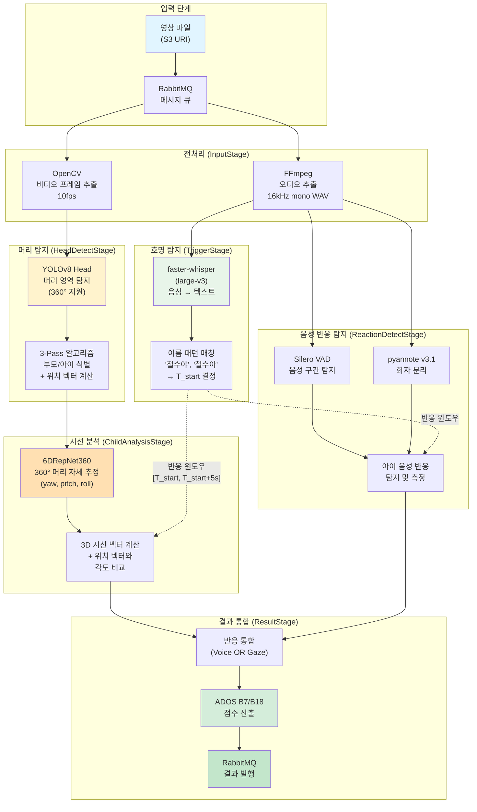

### 2.2 Audio + Vision 병렬 처리 구조

하나의 영상에서 **오디오**와 **비디오** 두 트랙을 동시에 분석합니다:

```mermaid
gantt
    title 파이프라인 병렬 처리 흐름
    dateFormat SS
    axisFormat %S초

    section 공통
    영상 다운로드 & 추출       :a0, 00, 2s

    section Audio 트랙
    Whisper 음성 인식          :a1, 02, 4s
    이름 호명 탐지 (T_start)   :a2, 06, 1s
    pyannote 화자 분리         :a3, 02, 5s
    Silero VAD                 :a4, 07, 2s
    아이 음성 반응 판정         :a5, 09, 1s

    section Vision 트랙
    YOLO 머리 탐지 (전 프레임)  :v1, 02, 3s
    3-Pass 부모/아이 식별       :v2, 05, 2s
    6DRepNet360 자세 추정       :v3, 07, 3s
    시선 각도 계산 & 반응 판정  :v4, 10, 1s

    section 통합
    Voice OR Gaze 통합         :r1, 11, 1s
    ADOS 점수 산출             :r2, 12, 1s
```

### 2.3 Multi-Trial 구조

하나의 영상에서 부모가 아이 이름을 **여러 번** 부를 수 있습니다.
각 호명이 하나의 **Trial**이 됩니다:

```
[영상 시작] ~~~~~~~~~ "철수야!" ~~~~~~~~~ "철수야!!" ~~~~~~~~~ "철수야!!!" ~~~ [영상 끝]
                       ↑ Trial 1           ↑ Trial 2             ↑ Trial 3
                       T_start=5.5s        T_start=12.3s         T_start=18.1s
                       |←── 5초 윈도우 ──→| |←── 5초 윈도우 ──→|  |←── 5초 윈도우 ──→|
```

각 Trial마다 독립적으로:
1. 시선 반응 (고개 돌림) 감지
2. 음성 반응 (대답) 감지
3. 반응 지연 시간 측정
4. 성공/실패 판정

---

## 3. 파이프라인 상세 단계

### 3.1 단계별 시퀀스 다이어그램

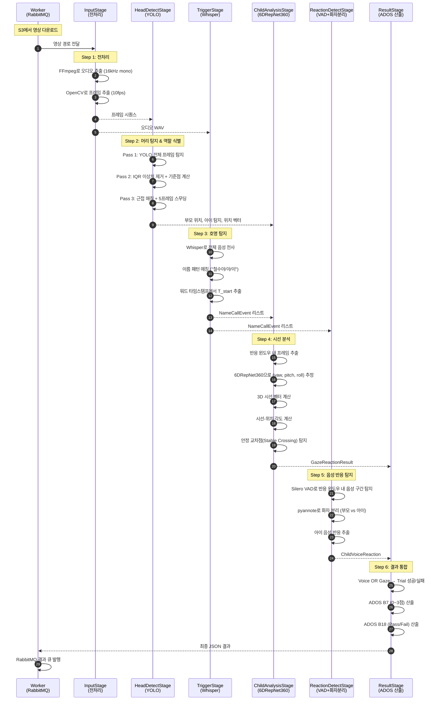

### 3.2 각 단계 상세 설명

#### **Step 1: 전처리 (InputStage)**

**목적**: 영상을 오디오와 비디오로 분리하여 각 분석 트랙에 공급

**오디오 추출:**
```
입력: video.mp4 (다양한 코덱, 샘플레이트)
    ↓ FFmpeg -vn -ar 16000 -ac 1 -acodec pcm_s16le
출력: temp.wav (16kHz, 모노, 16-bit PCM)
    ↓ soundfile / librosa
최종: np.ndarray (float32, [-1.0, 1.0], shape=(samples,))
```

**왜 16kHz 모노인가?**
| 파라미터 | 값 | 이유 |
|---------|-----|------|
| 샘플레이트 | 16,000Hz | Whisper, pyannote 모델의 기본 입력 해상도. 음성 대역(300~3400Hz)을 충분히 커버 |
| 채널 수 | 1 (모노) | 화자 분리 모델이 단일 채널 기준. 스테레오는 평균화 |
| 포맷 | float32 | 신경망 입력 표준. [-1, 1] 범위 정규화 |

**비디오 프레임 추출:**
```
입력: video.mp4 (1920x1080, 30fps)
    ↓ OpenCV VideoCapture + 다운샘플링
출력: List[PIL.Image] (10fps 기준)
```

**왜 10fps?**
- 원본 30fps는 과도한 중복 → 메모리/시간 낭비
- 10fps = 100ms 간격 → 고개 돌리는 동작(약 300ms~1s)을 충분히 캡처
- 30초 영상 기준 300 프레임 → GPU 배치 처리 최적

---

#### **Step 2: 머리 탐지 & 역할 식별 (HeadDetectStage)**

**목적**: 매 프레임에서 부모와 아이의 머리 위치를 탐지하고, 누가 부모이고 누가 아이인지 식별

**왜 "머리" 탐지인가?**

기존 접근법(MediaPipe FaceMesh 등)은 **정면 얼굴**만 감지할 수 있습니다.
하지만 비대면 호명 검사에서는 아이가 **뒤를 보고 있는 상태**에서 시작하므로, **뒤통수**도 감지해야 합니다.

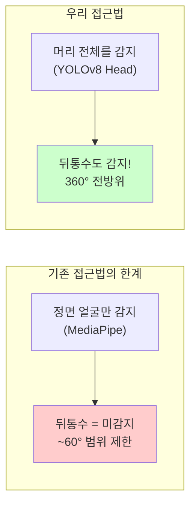

**YOLOv8 Head 모델 사양:**

| 항목 | 값 | 비고 |
|------|-----|------|
| 기반 아키텍처 | YOLOv8 + P2 Layer | 작은 객체(머리) 감지에 최적화 |
| 학습 데이터 | Kaggle Human Head Detection Dataset | 다양한 각도의 머리 포함 |
| 파인튜닝 | 자체 수행 | 아동 + 뒤통수 데이터 보강 |
| 신뢰도 임계값 | 0.15 | 낮은 임계값 → 놓치는 프레임 최소화 |
| 출력 | Bounding Box (cx, cy, w, h) + confidence |

**3-Pass 알고리즘:**

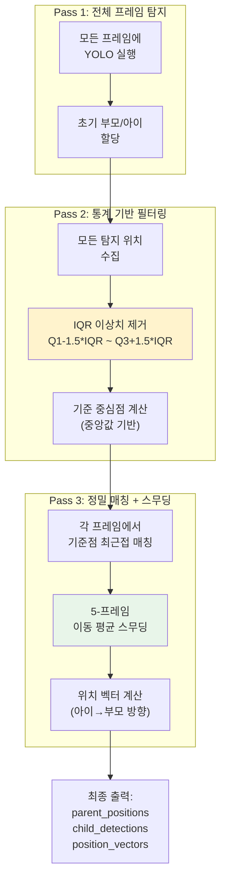

**IQR 이상치 제거 수식:**
```
Q1 = 25번째 백분위수
Q3 = 75번째 백분위수
IQR = Q3 - Q1

유효 범위: [Q1 - 1.5×IQR, Q3 + 1.5×IQR]

예시:
  부모 x좌표들: [620, 635, 640, 645, 650, 900]  ← 900은 다른 사람!
  Q1=635, Q3=650, IQR=15
  유효: [612.5, 672.5]
  → 900 제거됨!
```

**위치 벡터(Position Vector) 계산:**

아이에서 부모를 향하는 방향 벡터:
```
dx = parent_cx - child_cx
dy = parent_cy - child_cy
position_vector = normalize([dx, dy, 0.0])
```

이 벡터는 이후 **시선 벡터와 비교**하여 "아이가 부모를 보고 있는가?"를 판정하는 기준이 됩니다.

---

#### **Step 3: 호명 탐지 (TriggerStage)**

**목적**: 부모가 아이 이름을 부른 정확한 시점(T_start)을 밀리초 단위로 특정

**faster-whisper 모델:**

| 항목 | 값 | 비고 |
|------|-----|------|
| 모델 | large-v3 | OpenAI Whisper 최대 모델 |
| 최적화 | CTranslate2 | float16 양자화로 2~4배 가속 |
| 파라미터 수 | 15.5억 | 한국어 정확도 극대화 |
| 언어 | ko (한국어) | 한국어 전용 디코딩 |
| 타임스탬프 | Word-level | 단어 단위 시작/끝 시간 |

**이름 패턴 매칭:**

```python
# 한국어 호격 조사 패턴
patterns = [
    f"{child_name}(아|야|이)",   # "철수야", "철수아", "철수이"
    f"우리 {child_name}",        # "우리 철수" (애칭)
]
```

**T_start 결정 로직:**

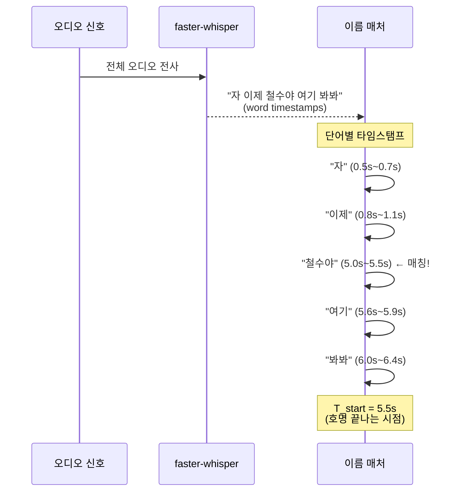

**왜 끝나는 시점(end)이 T_start인가?**
- 아이는 이름이 **완전히 발화된 후**에야 인지하고 반응합니다
- "철수"까지 들었을 때는 아직 누구를 부르는지 확정 불가
- "철수**야**"까지 완료되어야 호명 인지 → 반응 시작

---

#### **Step 4: 시선 분석 (ChildAnalysisStage)**

**목적**: 반응 윈도우 내에서 아이가 부모 방향으로 고개를 돌렸는지 판정

**핵심 알고리즘 흐름:**

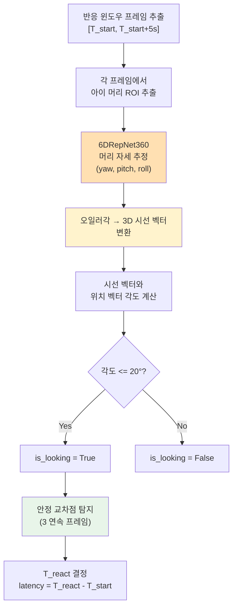

**프레임별 분석 상세:**

```python
def _analyze_frame_6d(frame, child_bbox, parent_center):
    """한 프레임에 대한 시선 분석"""

    # 1. 아이 머리 ROI 추출
    head_roi = crop_bbox(frame, child_bbox)

    # 2. 6DRepNet360으로 머리 자세 추정
    head_pose = model_6d.predict(head_roi)  # → HeadPose6D(yaw, pitch, roll)

    # 3. 오일러각 → 3D 시선 벡터 변환
    gaze_vector = head_pose.to_gaze_vector()

    # 4. 아이→부모 위치 벡터 계산
    position_vector = normalize(parent_center - child_center)

    # 5. 두 벡터 사이 각도 계산
    angle = angle_between_vectors(gaze_vector, position_vector)

    # 6. 각도 임계값 판정
    is_looking = (angle <= 20.0)  # GAZE_ANGLE_THRESHOLD_DEG

    return GazeFrameResult(
        angle_deg=angle,
        is_looking=is_looking,
        yaw_deg=head_pose.yaw,
        pitch_deg=head_pose.pitch,
        gaze_vector=gaze_vector,
        position_vector=position_vector
    )
```

**안정 교차점(Stable Crossing) 탐지:**

단순히 한 프레임에서 각도가 20° 이하라고 "쳐다봤다"고 판정하면 **노이즈에 의한 오판**이 발생합니다.
따라서 **N 연속 프레임**(기본 3프레임 = 300ms) 이상 유지되어야 진짜 반응으로 인정합니다.

```
프레임 각도 시퀀스: [45°, 35°, 22°, 18°, 17°, 15°, 16°, ...]
                                      ↑↑↑
                          임계값(20°) 이하가 3프레임 연속!
                          → T_react = 이 지점의 타임스탬프

실패 예시:  [45°, 35°, 18°, 25°, 19°, 16°, 15°, ...]
                         ↑    ↑
                   1프레임만 이하 → 노이즈, 무시
                                    ↑↑↑
                              여기서부터 3연속 → T_react
```

---

#### **Step 5: 음성 반응 탐지 (ReactionDetectStage)**

**목적**: 아이가 이름을 듣고 음성으로 반응했는지 (대답, 옹알이 등) 탐지

**2개 모델의 협업:**

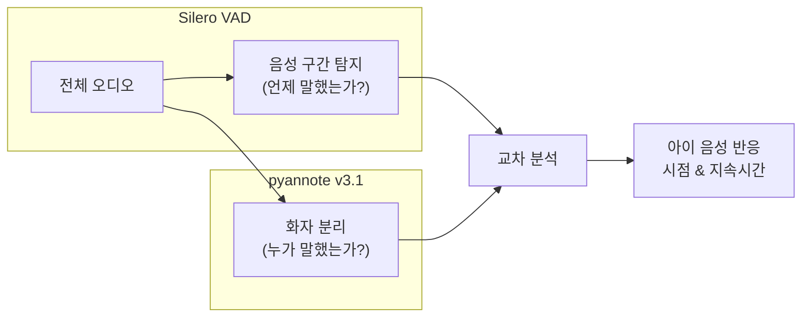

**Silero VAD (Voice Activity Detection):**

| 파라미터 | 값 | 의미 |
|---------|-----|------|
| threshold | 0.5 | 음성 확률 0.5 이상이면 "말하는 중" |
| min_speech_duration_ms | 250 | 250ms 미만 소리는 무시 (기침, 배경음) |
| min_silence_duration_ms | 100 | 100ms 이상 침묵이면 발화 분리 |
| window_size_samples | 512 | 32ms 윈도우로 처리 (16kHz 기준) |
| speech_pad_ms | 30 | 감지 구간 앞뒤 30ms 버퍼 |

**pyannote v3.1 화자 분리:**

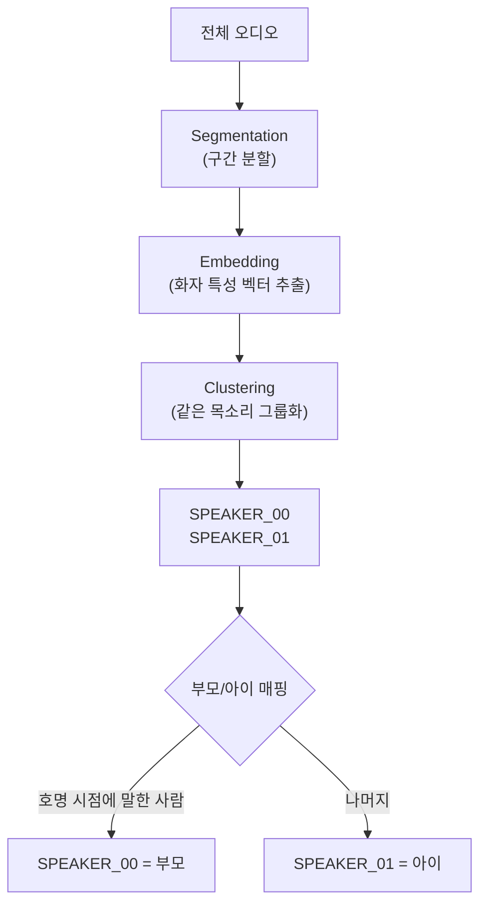

**화자 매핑 전략:**
- **핵심 가정**: 이름을 부른 사람 = 부모
- T_start 시점에 발화 중인 화자 → 부모로 태깅
- 나머지 화자 → 아이로 태깅
- (보조) 음성 주파수: 성인 85~255Hz vs 아동 250~400Hz

**아이 음성 반응 판정:**
```python
# 반응 윈도우: [T_start, T_start + 5.0초]
for speech_segment in vad_segments:
    if speech_segment.speaker == "CHILD":
        if T_start <= speech_segment.start <= T_start + 5.0:
            return ChildVoiceReaction(
                detected=True,
                latency_sec=speech_segment.start - T_start,
                duration_sec=speech_segment.end - speech_segment.start,
                confidence=speech_segment.confidence
            )
```

---

#### **Step 6: 결과 통합 (ResultStage)**

**목적**: 시선 반응과 음성 반응을 종합하여 최종 Trial 결과 및 ADOS 점수 산출

**반응 모드(Reaction Mode):**

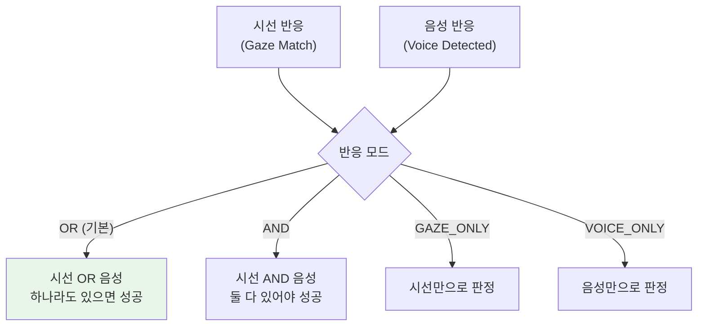

**기본 모드(OR)를 쓰는 이유:**
- 아이는 다양한 방식으로 반응합니다
- 고개만 돌리고 대답하지 않을 수 있고
- 대답만 하고 고개를 돌리지 않을 수 있습니다
- **어떤 방식이든 반응했다면** → 사회적 관심이 있다고 판단

**지연시간 우선순위:**
1. 음성 반응이 있으면 → 음성 지연시간 사용
2. 시선 반응만 있으면 → 시선 지연시간 사용
3. 둘 다 있으면 → 더 빠른 쪽 (음성 우선)

---

## 4. 핵심 AI 기술

### 4.1 YOLOv8 + P2 Layer (머리 탐지)

**왜 일반 YOLO가 아닌 P2 Layer 커스텀인가?**

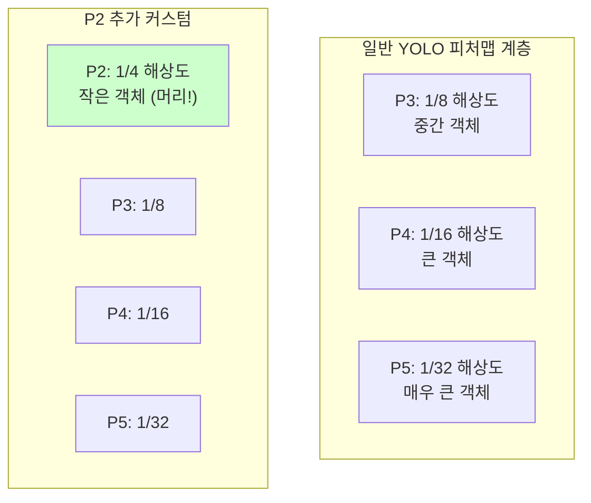

- **P2 Layer**: 입력 이미지의 1/4 해상도에서 피처를 추출
- 머리는 전신 대비 작은 영역 → P3~P5에서는 해상도가 부족
- P2를 추가하면 **작은 머리**도 정밀하게 감지 가능
- 특히 카메라에서 먼 아이의 작은 머리 감지에 효과적

**신뢰도 임계값 0.15의 의미:**
- 일반적인 YOLO는 0.5~0.7을 사용
- 0.15로 낮춘 이유: **놓치는 프레임을 최소화**
- 오탐(False Positive)은 IQR 이상치 제거로 후처리에서 걸러냄
- 미탐(False Negative)은 복구 불가능하므로, 일단 많이 잡는 전략

### 4.2 6DRepNet360 (360° 머리 자세 추정)

**왜 "6D"인가? - 회전 표현의 수학**

3D 공간에서 물체의 회전을 표현하는 방법은 여러 가지입니다:

| 표현법 | 차원 | 장점 | 단점 |
|-------|------|------|------|
| 오일러각 (yaw, pitch, roll) | 3D | 직관적 | **짐벌 락(Gimbal Lock)** 발생 |
| 쿼터니언 (w, x, y, z) | 4D | 연속적 | 비직관적, 이중 커버 |
| 회전 행렬 (3×3) | 9D | 완전한 표현 | 9개 파라미터는 과다 (6개 자유도인데) |
| **6D 정사영** | **6D** | **연속적 + 최소 표현** | 후처리 필요 (Gram-Schmidt) |

**6D 정사영(Orthographic Projection)의 원리:**

3×3 회전 행렬에서 **처음 2개 열 벡터(6개 값)**만 추출합니다:

```
회전 행렬 R = [r1 | r2 | r3]   (3×3, 9개 값)
                ↓
6D 표현 = [r1, r2]             (6개 값)
                ↓
복원: r3 = r1 × r2             (외적으로 3번째 열 복원)
      → Gram-Schmidt로 직교화
      → 완전한 3×3 회전 행렬 복원
```

**왜 이것이 혁신인가?**

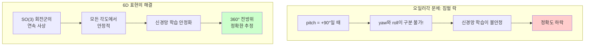

**6DRepNet360의 내부 구조:**

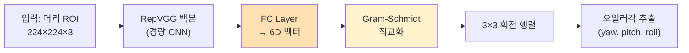

| 항목 | 값 |
|------|-----|
| 백본 | RepVGG (추론 시 단일 경로 변환) |
| 학습 데이터 | 300W-LP (다양한 인종/각도/조명) |
| 출력 범위 | yaw: -180°~+180°, pitch: -90°~+90°, roll: -180°~+180° |
| **360° 지원** | yaw 기준 뒤통수(±180°)까지 추정 가능 |

### 4.3 faster-whisper (음성 인식)

**OpenAI Whisper vs faster-whisper:**

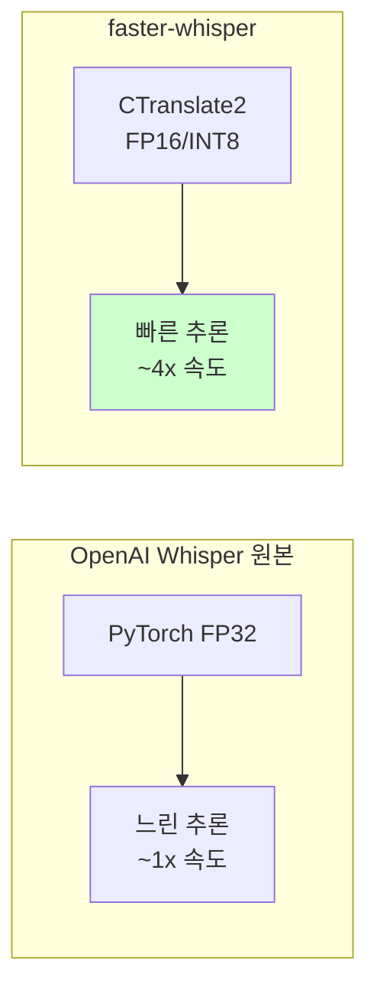

| 모델 크기 | 파라미터 | VRAM | large-v3 대비 속도 |
|-----------|---------|------|-------------------|
| tiny | 39M | ~1GB | ~32x |
| base | 74M | ~1GB | ~16x |
| small | 244M | ~2GB | ~6x |
| medium | 769M | ~5GB | ~2x |
| **large-v3** (채택) | **1,550M** | **~10GB** | 1x (기준) |

**large-v3를 채택한 이유:**
- 한국어 인식 정확도가 모델 크기에 비례
- 특히 **아이 이름** 같은 고유명사 인식에서 small/medium과 차이 큼
- Word-level 타임스탬프의 정밀도도 large-v3가 가장 높음
- CTranslate2 최적화로 실시간 처리 가능

### 4.4 Silero VAD (음성 활동 감지)

**특징:**
- 모델 크기: ~1MB (초경량)
- 추론 속도: 오디오 길이의 1/1000 이하
- 정확도: 상용 VAD 대비 동등 수준
- PyTorch Hub에서 즉시 로드 가능

### 4.5 pyannote-audio v3.1 (화자 분리)

**아키텍처:**

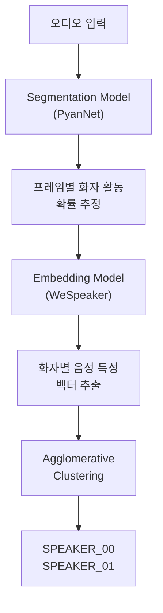

**화자 수 제약:**
- `min_speakers=1`: 부모 혼자 말할 수도 있음
- `max_speakers=2`: 부모 + 아이 (제3자 배제)

### 4.6 모델 싱글톤(Singleton) 패턴

**문제**: 5개 딥러닝 모델을 매 요청마다 로드하면?
- 6DRepNet360: ~300MB → 로드 3초
- Whisper large-v3: ~6GB → 로드 15초
- pyannote: ~500MB → 로드 5초
- YOLO: ~30MB → 로드 1초
- Silero: ~1MB → 로드 0.1초
- **총 24초 낭비** (매 요청마다!)

**해결: BaseModel 싱글톤:**

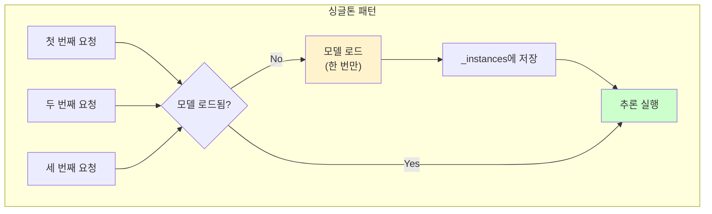

```python
class BaseModel(ABC, Generic[T]):
    _instances: dict = {}  # 클래스 레벨 저장소

    def __new__(cls):
        if cls not in cls._instances:
            instance = super().__new__(cls)
            instance._model = None
            instance._model_loaded = False
            cls._instances[cls] = instance
        return cls._instances[cls]

    def ensure_loaded(self):
        if not self._model_loaded:
            self._load_model()       # 서브클래스가 구현
            self._model_loaded = True
```

**효과:**
- 첫 번째 요청: 24초 (모델 로드)
- **두 번째 요청부터: 0초** (이미 로드된 모델 재사용)
- 메모리 효율: 동일 모델 인스턴스 공유

---

## 5. 6D 정사영과 시선 원뿔(Gaze Cone) 이론

### 5.1 오일러각에서 시선 벡터로의 변환

6DRepNet360이 출력한 오일러각(yaw, pitch, roll)을 **3D 시선 벡터**로 변환해야 합니다.

**좌표계 정의:**

```
           Y축 (위)
           ↑
           |
           |  Z축 (카메라 방향, 앞)
           | /
           |/
    ───────O────────→ X축 (오른쪽)
```

**오일러각의 의미:**

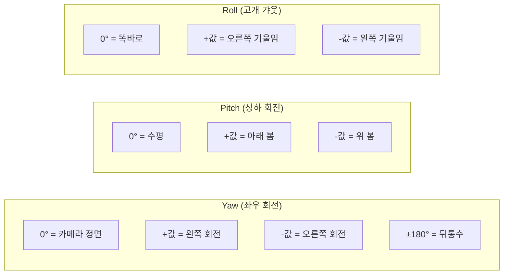

**변환 공식:**

```
yaw_rad = yaw_deg × π/180
pitch_rad = pitch_deg × π/180

시선 벡터 (gaze_vector):
    x = -cos(pitch) × sin(yaw)
    y =  sin(pitch)
    z =  cos(pitch) × cos(yaw)

정규화: gaze_vector = gaze_vector / ||gaze_vector||
```

**왜 x에 음수(-)가 붙는가?**
- 6DRepNet360: 왼쪽 회전 = +yaw
- 픽셀 좌표: 오른쪽 = +x
- 부호 반전으로 좌표계 정렬

**시선 벡터 해석 예시:**

| 상황 | yaw | pitch | 시선 벡터 (x, y, z) | 해석 |
|------|-----|-------|-------------------|------|
| 카메라 정면 | 0° | 0° | (0, 0, 1) | 카메라를 똑바로 봄 |
| 왼쪽 90° | +90° | 0° | (-1, 0, 0) | 왼쪽을 봄 |
| 오른쪽 90° | -90° | 0° | (1, 0, 0) | 오른쪽을 봄 |
| 뒤통수 | ±180° | 0° | (0, 0, -1) | 카메라 반대쪽을 봄 |
| 아래 45° | 0° | +45° | (0, 0.71, 0.71) | 아래 45° 봄 |

### 5.2 시선 원뿔(Gaze Cone) 모델

**개념:**

아이의 머리에서 시선 방향으로 뻗어나가는 **3D 원뿔(cone)**을 상상합니다.
이 원뿔의 반각(half-angle)이 **GAZE_ANGLE_THRESHOLD_DEG** (20°)입니다.

```
                        시선 벡터 (gaze_vector)
                       /
                      /  20° (반각)
                     / _/
             아이 머리 O ─────────→ 시선 방향
                     \ ‾\
                      \  20°
                       \
                        ← 원뿔 경계
```

**부모의 머리 중심이 이 원뿔 안에 있으면 → "쳐다보고 있다"**

```
Case 1: 각도 12° → 원뿔 안 → is_looking = True (부모를 보고 있다!)
Case 2: 각도 35° → 원뿔 밖 → is_looking = False (다른 곳을 보고 있다)
```

### 5.3 3D 벡터 각도 계산

**두 벡터 사이의 각도를 구하는 공식:**

```
v1 = gaze_vector     (아이의 시선 방향)
v2 = position_vector  (아이→부모 방향)

cos(θ) = (v1 · v2) / (||v1|| × ||v2||)

θ = arccos(clip(cos(θ), -1, 1))    ← 부동소수점 오차 방지

θ_deg = θ × 180 / π
```

**수학적 의미:**

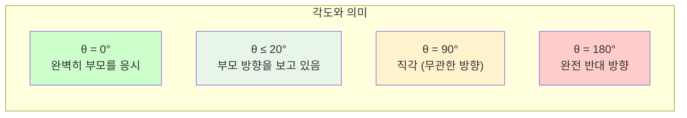

### 5.4 2D 변형: Y축 가중치 보정

실환경에서 pitch(상하) 추정은 yaw(좌우) 추정보다 노이즈가 큽니다.
이를 보정하기 위한 2D 변형이 존재합니다:

```
y_weight = 0.3  (pitch 영향을 70% 감쇄)

g = [gaze_x, gaze_y × y_weight]
p = [position_x, position_y × y_weight]

θ = arccos(dot(normalize(g), normalize(p))) × 180/π
```

**왜 pitch를 감쇄하는가?**
- 카메라 높이 ≠ 아이 눈높이 → pitch에 체계적 편향 발생
- 아이가 위를 올려다보며 부모를 볼 때, pitch가 과대 추정되기 쉬움
- yaw(좌우 회전)가 "고개 돌림"의 핵심 지표

### 5.5 EMA(지수 이동 평균) 스무딩

**문제**: 6DRepNet360 출력이 프레임마다 미세하게 흔들림

**해결**: 별도의 EMA 스무딩을 적용하여 시계열 안정화

```
new_value = α × current + (1 - α) × previous

α 값별 의미:
  α = 1.0 → 스무딩 없음 (현재 값 그대로)
  α = 0.0 → 완전 고정 (이전 값 그대로)
```

| 대상 | α 값 | 의미 |
|------|------|------|
| 머리 자세 (pose) | 0.3 | 강한 스무딩 (노이즈 많으므로) |
| 시선 방향 (gaze) | 0.4 | 중간 스무딩 |
| 바운딩 박스 (bbox) | 0.5 | 약한 스무딩 (위치는 비교적 안정) |

**효과:**
```
스무딩 전: yaw = [45.2, 43.8, 48.1, 44.5, 46.3, ...]  (흔들림)
스무딩 후: yaw = [45.2, 44.8, 45.8, 45.4, 45.7, ...]  (부드러움)
```

---

## 6. ADOS 평가 기준

### 6.1 ADOS란?

**Autism Diagnostic Observation Schedule** - 자폐 진단의 골드 스탠다드

본 시스템은 **ADOS Toddler Module** (12~36개월)의 이름 부르기 항목을 자동 평가합니다.

### 6.2 우리가 측정하는 2가지 지표

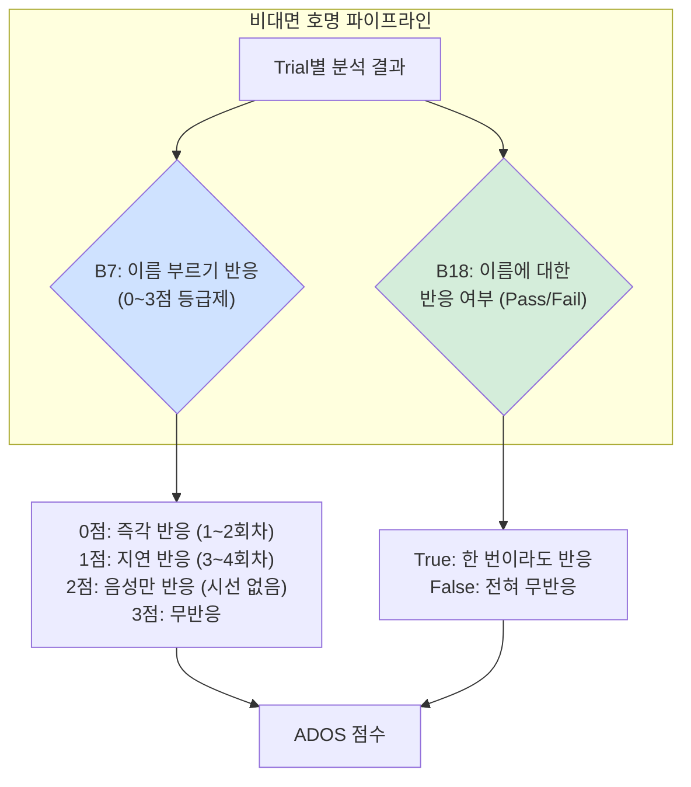

#### **B7: Response to Name (이름 부르기 반응) - 0~3점**

| 점수 | 기준 | 임상적 의미 |
|------|------|-----------|
| **0** | 1~2번째 호명에서 즉시(≤3초) 시선 반응 | 정상 발달. 이름 부르면 바로 쳐다봄 |
| **1** | 3~4번째 호명에서야 시선 반응 | 약간의 지연. 반복 호명 필요 |
| **2** | 시선 반응 없이 음성으로만 반응 | 사회적 시선 접촉 부족 우려 |
| **3** | 어떤 반응도 없음 | 심각한 사회적 관심 부족 |

```python
def _calculate_ados_b7(trial_results):
    """ADOS B7 점수 산출"""
    # 즉시 시선 반응한 Trial 수집 (latency ≤ 3초)
    immediate_gaze = [
        tr for tr in trial_results
        if tr.gaze_match and tr.latency_s <= 3.0
    ]

    # 1~2번째 Trial에서 즉시 반응 → 0점 (최고)
    if any(tr.trial_index in [1, 2] for tr in immediate_gaze):
        return 0

    # 3~4번째 Trial에서 즉시 반응 → 1점
    if any(tr.trial_index in [3, 4] for tr in immediate_gaze):
        return 1

    # 시선 반응은 없지만 음성 반응이 있음 → 2점
    if any(tr.voice_detected for tr in trial_results):
        return 2

    # 아무 반응 없음 → 3점 (최저)
    return 3
```

#### **B18: Overall Response (전반적 반응 여부) - Pass/Fail**

```python
def _calculate_ados_b18(trial_results):
    """전체 Trial 중 하나라도 성공했는가?"""
    return any(tr.success for tr in trial_results)
```

### 6.3 임상적 해석

| B7 | B18 | 임상적 의미 | 권장 조치 |
|----|-----|-----------|----------|
| 0 | True | 정상 발달 | 정기 검진 |
| 1 | True | 경미한 지연 | 3개월 후 재평가 |
| 2 | True | 시선 접촉 부족 | 소아과 상담 권장 |
| 3 | False | 심각한 무반응 | 발달 전문의 즉시 의뢰 |

---

## 7. 실전 예시

### 7.1 성공 케이스 (정상 발달)

**입력:**
- 영상: 25초, 1920x1080, 30fps
- 아이 이름: "철수"
- 아이 나이: 24개월
- 상황: 아이가 장난감을 보며 등을 돌리고 앉아있음

**처리 과정:**

```
[InputStage]
2026-02-08 10:00:00 | INFO | 영상 다운로드 완료 (25초)
2026-02-08 10:00:01 | INFO | 오디오 추출: 16kHz mono WAV (400,000 samples)
2026-02-08 10:00:01 | INFO | 프레임 추출: 250개 (10fps × 25초)

[HeadDetectStage]
2026-02-08 10:00:02 | INFO | YOLO Pass 1: 250개 프레임 탐지 완료
2026-02-08 10:00:03 | INFO | Pass 2: 기준점 - 부모(640, 180), 아이(400, 400)
2026-02-08 10:00:04 | INFO | Pass 3: 위치 벡터 계산 완료 (탐지율 98.4%)

[TriggerStage]
2026-02-08 10:00:05 | INFO | Whisper 전사: "자 이제... 철수야! 여기 봐봐... 철수야!!"
2026-02-08 10:00:06 | INFO | 호명 탐지:
  - Trial 1: "철수야" T_start=5.5s
  - Trial 2: "철수야" T_start=12.3s

[ChildAnalysisStage - Trial 1]
2026-02-08 10:00:07 | INFO | 반응 윈도우: [5.5s ~ 10.5s]
2026-02-08 10:00:08 | INFO | 6DRepNet360 프레임별 분석:
  - 5.5s: yaw=-155°, angle=162° (뒤통수, 아직 안 돌아봄)
  - 5.8s: yaw=-120°, angle=128° (고개 돌리기 시작)
  - 6.0s: yaw=-60°,  angle=52°  (돌아보는 중)
  - 6.2s: yaw=-15°,  angle=18°  (부모 방향!)
  - 6.3s: yaw=-12°,  angle=15°  (유지!)
  - 6.4s: yaw=-10°,  angle=13°  (유지! → 3연속 안정!)
2026-02-08 10:00:08 | INFO | T_react=6.2s, latency=0.7s, gaze_match=True

[ChildAnalysisStage - Trial 2]
2026-02-08 10:00:09 | INFO | 이미 부모를 보고 있는 상태
2026-02-08 10:00:09 | INFO | angle=12° (즉시 반응), latency=0.1s

[ReactionDetectStage - Trial 1]
2026-02-08 10:00:10 | INFO | VAD: 6.5s~7.1s 음성 감지
2026-02-08 10:00:10 | INFO | 화자: SPEAKER_01 (아이)
2026-02-08 10:00:10 | INFO | voice_detected=True, latency=1.0s

[ResultStage]
2026-02-08 10:00:11 | INFO | Trial 1: SUCCESS (gaze=True OR voice=True)
2026-02-08 10:00:11 | INFO | Trial 2: SUCCESS (gaze=True)
2026-02-08 10:00:11 | INFO | ADOS B7=0 (1번째에서 즉시 반응)
2026-02-08 10:00:11 | INFO | ADOS B18=True
```

**출력 JSON:**
```json
{
  "examId": "exam_001",
  "videoId": "vid_123",
  "videoType": "NAME_NON_FACING",
  "analyzedAt": "2026-02-08T10:00:11.000Z",
  "status": "SUCCESS",
  "metrics": {
    "per_trial": [
      {
        "trial_index": 1,
        "success": true,
        "latency_s": 0.7,
        "trigger_start_s": 5.0,
        "trigger_end_s": 5.5,
        "trigger_text": "철수야",
        "voice_detected": true,
        "voice_start_s": 6.5,
        "voice_end_s": 7.1,
        "voice_duration_s": 0.6,
        "voice_confidence": 0.92,
        "gaze_match": true,
        "gaze_duration_s": 2.8,
        "head_yaw_deg": -15.0,
        "head_pitch_deg": 5.0
      },
      {
        "trial_index": 2,
        "success": true,
        "latency_s": 0.1,
        "trigger_start_s": 12.0,
        "trigger_end_s": 12.3,
        "trigger_text": "철수야",
        "voice_detected": false,
        "gaze_match": true,
        "gaze_duration_s": 4.2,
        "head_yaw_deg": -12.0,
        "head_pitch_deg": 3.0
      }
    ]
  },
  "ADOS": {
    "B7": 0,
    "B18": true
  }
}
```

### 7.2 우려 케이스 (발달 지연 의심)

**상황**: 아이가 이름을 불러도 거의 반응하지 않음

```
[TriggerStage]
호명 탐지:
  - Trial 1: "민수야" T_start=4.2s
  - Trial 2: "민수야!" T_start=10.8s
  - Trial 3: "야 민수야!!" T_start=16.5s

[ChildAnalysisStage]
Trial 1: 반응 윈도우 [4.2s ~ 9.2s]
  - 전 프레임 yaw > 140° (계속 뒤를 보고 있음)
  - angle 최소값 = 135° (임계값 20° 훨씬 초과)
  - gaze_match = False

Trial 2: 반응 윈도우 [10.8s ~ 15.8s]
  - 전 프레임 yaw > 130°
  - angle 최소값 = 125°
  - gaze_match = False

Trial 3: 반응 윈도우 [16.5s ~ 21.5s]
  - 18.0s에 yaw가 잠깐 80°로 바뀜 (고개 살짝 돌림)
  - 하지만 angle = 65° (임계값 20° 초과)
  - 1프레임 후 다시 150°로 복귀 (장난감에 다시 집중)
  - gaze_match = False

[ReactionDetectStage]
Trial 1~3: 모두 voice_detected = False (아무 음성 반응 없음)

[ResultStage]
Trial 1: FAIL (gaze=False, voice=False)
Trial 2: FAIL (gaze=False, voice=False)
Trial 3: FAIL (gaze=False, voice=False)

ADOS B7 = 3 (어떤 반응도 없음 → 최고 우려 점수)
ADOS B18 = False (한 번도 성공하지 못함)
```

**출력 JSON:**
```json
{
  "examId": "exam_002",
  "status": "SUCCESS",
  "metrics": {
    "per_trial": [
      {"trial_index": 1, "success": false, "gaze_match": false, "voice_detected": false},
      {"trial_index": 2, "success": false, "gaze_match": false, "voice_detected": false},
      {"trial_index": 3, "success": false, "gaze_match": false, "voice_detected": false}
    ]
  },
  "ADOS": {
    "B7": 3,
    "B18": false
  }
}
```

### 7.3 흥미로운 경계 케이스

**케이스 A: 음성만 반응 (시선 반응 없음)**

```
Trial 1: gaze_match=False, voice_detected=True (latency=2.1s)
  → 아이가 "응~" 하고 대답했지만 고개는 안 돌림
  → success=True (OR 모드이므로)

Trial 2: gaze_match=False, voice_detected=True (latency=1.8s)
  → 또 대답만 함

ADOS B7 = 2 (음성만 반응, 시선 접촉 없음)
ADOS B18 = True (반응은 있었으므로)
→ 임상 해석: "사회적 시선 접촉이 부족하지만, 이름은 인식하고 있음"
```

**케이스 B: 1인칭 시점 (부모 미감지)**

```
[HeadDetectStage]
Pass 2: 부모 탐지율 = 0% (카메라 = 부모 시점)
→ is_first_person_view = True
→ 위치 벡터 = 카메라 방향 (0, 0, 1) 기본값 사용
→ 시선 분석 계속 진행 가능!
```

---

## 8. 기술적 혁신 포인트

### 8.1 360° 전방위 추적 (vs 전통적 ~90° 제한)

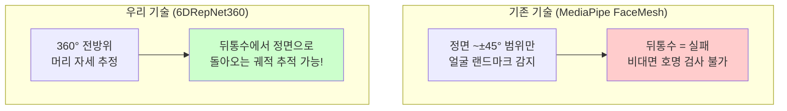

**핵심**: 비대면 호명 검사의 본질은 **"뒤를 보다가 → 앞으로 돌아보는"** 행동을 감지하는 것.
이 전환 구간을 추적하려면 반드시 360° 범위를 커버해야 합니다.

### 8.2 3D 시선 원뿔 판정 (vs 단순 yaw 임계값)

```mermaid
graph LR
    subgraph "단순 방식"
        A["yaw < 30°이면<br/>'정면을 봄'"] --> B["문제: 부모가 오른쪽에<br/>있으면 yaw=30°여도<br/>부모를 안 보는 것"]
    end

    subgraph "시선 원뿔 방식"
        C["시선 벡터와 부모 방향<br/>벡터의 각도 < 20°"] --> D["부모가 어디에 있든<br/>정확한 시선 판정!"]
    end

    style B fill:#ffcccc
    style D fill:#ccffcc
```

### 8.3 멀티모달 융합 (Audio + Vision)

단일 모달리티로는 놓칠 수 있는 반응을 **두 채널 교차 검증**으로 포착:

| 상황 | Vision만 | Audio만 | 멀티모달 (ours) |
|------|---------|---------|---------------|
| 고개 돌리며 대답 | O | O | O (두 채널 일치) |
| 고개만 돌림 (무언) | O | X | O (Vision으로 포착) |
| 대답만 함 (고개 안 돌림) | X | O | O (Audio로 포착) |
| 고개 살짝 돌렸다 복귀 | 모호 | X | O (Audio로 보완) |

### 8.4 밀리초 단위 정밀 타이밍

**기존 ADOS 평가**: "빨리/느리게 반응" (주관적 판단)

**우리 시스템**:
```
호명 완료: T_start = 5.500s (Whisper word timestamp)
시선 반응: T_react = 6.200s (프레임 타임스탬프)
→ 반응 지연 = 0.700s (±0.1s 정밀도)
```

- 음성: 32ms 해상도 (VAD 윈도우 크기)
- 시선: 100ms 해상도 (10fps)
- 임상적으로 충분한 정밀도 (수동 평가 오차 ~±500ms)

### 8.5 파이프라인 스테이지 아키텍처

```mermaid
graph LR
    subgraph "확장성"
        A["BaseStage<br/>(추상 클래스)"] --> B["InputStage"]
        A --> C["HeadDetectStage"]
        A --> D["TriggerStage"]
        A --> E["ChildAnalysisStage"]
        A --> F["ReactionDetectStage"]
        A --> G["ResultStage"]
    end

    subgraph "오케스트레이터"
        H["AudioPipelineOrchestrator<br/>(Audio만)"]
        I["FullPipelineOrchestrator<br/>(Audio+Vision)"]
    end
```

- **모듈 교체 가능**: 모델을 바꾸고 싶으면 해당 Stage만 교체
- **오케스트레이터 선택**: 상황에 따라 Audio-only / Full 파이프라인 전환
- **PipelineContext**: 모든 Stage가 공유하는 중앙 데이터 컨테이너

---

## 9. 성능 지표

### 9.1 처리 속도

| 단계 | 소요 시간 | 디바이스 | 비고 |
|------|----------|---------|------|
| 영상 다운로드 & 추출 | ~1.5초 | CPU | FFmpeg + OpenCV |
| YOLO 머리 탐지 (250 프레임) | ~2.5초 | GPU | 배치 처리 |
| Whisper 음성 인식 | ~4.0초 | GPU | large-v3 |
| pyannote 화자 분리 | ~3.0초 | GPU | |
| 6DRepNet360 자세 추정 | ~2.0초 | GPU | 반응 윈도우 프레임만 |
| 시선 각도 계산 | ~0.2초 | CPU | 벡터 연산 |
| Silero VAD | ~0.3초 | CPU | 초경량 |
| 결과 통합 & ADOS 산출 | ~0.1초 | CPU | |
| **총 처리 시간** | **~14초** | | **25초 영상 기준** |

**실시간 비율**: 25초 영상 / 14초 처리 = **1.8x 실시간** (실시간보다 빠름)

### 9.2 모델 메모리 사용량

| 모델 | GPU VRAM | 비고 |
|------|----------|------|
| YOLOv8 Head (P2) | ~200MB | |
| 6DRepNet360 | ~300MB | |
| faster-whisper large-v3 | ~6GB | 가장 큰 모델 |
| pyannote v3.1 | ~500MB | |
| Silero VAD | ~5MB | CPU 전용 |
| **총합** | **~7GB** | T4 (16GB) 충분 |

### 9.3 확장성 (RabbitMQ 기반)

```mermaid
graph LR
    subgraph "수평 확장"
        A["Backend"] --> B["RabbitMQ"]
        B --> C["Worker 1<br/>(GPU 서버)"]
        B --> D["Worker 2<br/>(GPU 서버)"]
        B --> E["Worker N<br/>(GPU 서버)"]
    end

    C --> F["결과 큐"]
    D --> F
    E --> F
    F --> A
```

- **큐 영속성**: `durable=True` → RabbitMQ 재시작해도 메시지 보존
- **메시지 영속성**: `delivery_mode=2` → 디스크 저장
- **재연결**: 지수 백오프 재시도 (최대 5회, delay × 2)
- **워커 수 증가** → 처리량 선형 확장

---

## 10. 프로젝트 구조

```
app/
├── worker.py                        # RabbitMQ 소비자 (진입점)
├── main.py                          # FastAPI 헬스체크 API
├── config.py                        # Pydantic 설정 관리
│
├── pipeline/
│   ├── context.py                   # PipelineContext, TrialResult
│   ├── orchestrator.py              # Audio/Full 오케스트레이터
│   └── stages/
│       ├── base_stage.py            # BaseStage 템플릿
│       ├── input_stage.py           # 오디오/비디오 추출
│       ├── head_detect_stage.py     # YOLO 머리 탐지
│       ├── trigger_stage.py         # Whisper 호명 탐지
│       ├── child_analysis_stage.py  # 6DRepNet360 시선 분석
│       ├── reaction_detect_stage.py # VAD + 화자 분리
│       └── result_stage.py          # 통합 & ADOS 산출
│
├── models/
│   ├── base.py                      # BaseModel 싱글톤
│   ├── head_detector.py             # YOLO 래퍼
│   ├── head_pose_6d.py              # 6DRepNet360 래퍼
│   ├── speech_recognizer.py         # faster-whisper 래퍼
│   ├── speaker_diarizer.py          # pyannote 래퍼
│   └── vad.py                       # Silero VAD 래퍼
│
├── core/
│   ├── gaze_calculator.py           # 오일러→벡터, 각도 계산
│   ├── gaze_analyzer.py             # Trial별 시선 분석
│   ├── angle_calculator.py          # 벡터 각도 유틸리티
│   └── vector_math.py               # 범용 벡터 연산
│
├── services/
│   └── rabbitmq.py                  # RabbitMQ 서비스
│
└── utils/
    ├── audio.py                     # FFmpeg, 오디오 로딩
    ├── video.py                     # 프레임 추출
    ├── visualize.py                 # 디버그 시각화
    └── logger.py                    # 로깅 설정
```

---

## 11. 참고 문헌

**논문:**
1. **6DRepNet360**: Hempel et al., "6D Rotation Representation for Unconstrained Head Pose Estimation" (2022) — 6D 연속 회전 표현을 활용한 360° 머리 자세 추정
2. **YOLOv8**: Jocher et al., Ultralytics YOLOv8 (2023) — 실시간 객체 탐지 프레임워크
3. **Whisper**: Radford et al., "Robust Speech Recognition via Large-Scale Weak Supervision" (2023) — 대규모 다국어 음성 인식
4. **pyannote-audio**: Bredin et al., "pyannote.audio 2.1: Speaker Diarization Pipeline" (2023) — End-to-end 화자 분리
5. **Silero VAD**: Silero Team, "Silero VAD: Pre-trained Enterprise-grade Voice Activity Detector" (2021)
6. **6D Rotation**: Zhou et al., "On the Continuity of Rotation Representations in Neural Networks" (CVPR 2019) — 6D 표현의 수학적 근거 (SO(3)의 연속 사상)

**데이터셋:**
- 300W-LP: 3D Face Alignment in the Wild (머리 자세 학습)
- Kaggle Human Head Detection (머리 탐지 학습)

**프레임워크:**
- PyTorch, OpenCV, NumPy
- CTranslate2 (faster-whisper 최적화 엔진)
- pika (RabbitMQ Python 클라이언트)
- Pydantic (설정 검증)
- FastAPI (헬스체크 API)

---

**버전:** 1.0.0
**최종 수정:** 2026-02-08
**작성자:** AI Time 개발팀
