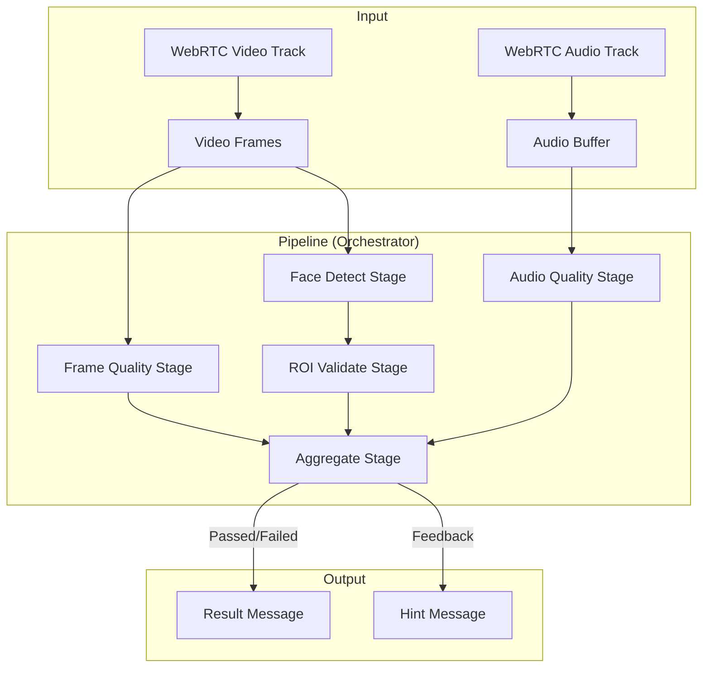

# 프리플라이트 스크리닝 (Preflight Screening)

본 서비스는 실시간 분석(Face-to-Face, Name Response 등)을 시작하기 전, **검사 환경의 품질**과 **사용자의 위치**가 적절한지 실시간으로 검증하는 WebRTC 기반 전처리 서비스입니다.

---

## 🚀 파이프라인 개요

본 서비스는 음성(PCM)과 영상(Frame) 데이터를 실시간으로 수신하여, 슬라이딩 윈도우(Sliding Window) 방식으로 최근 상태를 집계하고 최종 통과 여부를 결정합니다.



---

## 🛠 단계별 상세 설명 및 모델

### 1. Audio Quality Stage
- **기능**: 주변 소음 수준을 측정하여 검사에 적합한 정숙한 환경인지 판별합니다.
- **모델/알고리즘**: RMS(Root Mean Square) dBFS 계산
- **상세**: 0.5초 단위 척크(Chunk)를 버퍼링하여 평균 음압을 산출합니다. 설정된 임계값(Default: -35dBFS)을 초과할 경우 `NOISE_HIGH` 플래그를 발생시킵니다.

### 2. Frame Quality Stage
- **기능**: 조명 상태가 얼굴 분석에 충분히 밝은지 확인합니다.
- **모델/알고리즘**: Luma(밝기) Mean 및 Percentile(p10) 분석
- **상세**: 영상의 전체 평균 밝기뿐만 아니라 하위 10% 밝기(p10)를 동시에 체크하여, 역광이나 부분적 저조도 상황에서도 안정적으로 어두움을 감지합니다.

### 3. Face Detect Stage
- **기능**: 화면 내에 검사 대상자(부모 및 아동)가 적절한 인원수(2명)만큼 존재하는지 확인합니다.
- **모델/알고리즘**: **OpenCV Haar Cascade** (`haarcascade_frontalface_default.xml`)
- **상세**: 실시간성을 위해 고해상도 영상은 50% 리사이즈하여 빠르게 얼굴을 탐색합니다. `TOO_FEW_FACES`, `TOO_MANY_FACES` 플래그를 통해 피드백을 구분합니다.

### 4. ROI Validate Stage
- **기능**: 탐지된 얼굴이 사전에 정의된 두 개의 좌/우 영역(ROI) 안에 각각 위치하는지 확인합니다.
- **모델/알고리즘**: Center-in-ROI (기하학적 검증)
- **상세**: 각 얼굴 박스의 중심점이 설정된 ROI 박스 안에 포함되는지 확인합니다. 한쪽이라도 비어 있을 경우 `ROI_FACE_MISSING_1/2` 플래그를 발생시킵니다.

### 5. Aggregate Stage
- **기능**: 각 스테이지의 결과를 슬라이딩 윈도우 방식으로 집계하여 최종 `Pass/Fail`을 결정합니다.
- **모델/알고리즘**: Rule-based Decision Logic
- **상세**: 최근 5초(window_sec) 동안의 지표가 특정 비율 이상 성공했을 때만 최종 승인을 내립니다. 실패 시에는 가장 우선순위가 높은 원인에 대해 힌트 메시지를 생성합니다.

---

## 💻 기술 스택

- **Backend**: Python 3.11+, FastAPI
- **WebRTC**: aiortc
- **Computer Vision**: OpenCV, Numpy
- **Config**: PyYAML
- **Logging**: Python Standard Logging

---

## 🏃 실행 방법

1. **의존성 설치**
   ```bash
   pip install -r requirements.txt
   ```

2. **서버 실행**
   ```bash
   python -m uvicorn src.serving.app:app --host 0.0.0.0 --port 8000
   ```

3. **테스트 클라이언트**
   `client.html` 파일을 브라우저로 열어 "Start" 버튼을 누르면 실시간으로 카메라를 공유하며 스크리닝 결과를 로그로 확인할 수 있습니다.
