# 프리플라이트 스크리닝 (Preflight Screening)

본 서비스는 실시간 분석(Face-to-Face, Name Response 등)을 시작하기 전, **검사 환경의 품질**과 **사용자의 위치**가 적절한지 실시간으로 검증하는 WebRTC 기반 전처리 서비스입니다.

---

## 🚀 전체 실행 프로세스 (Full Execution Process)

본 서비스는 다음 두 가지 모드 중 하나로 동작합니다.

1.  **Connection (Legacy/Local)**: 클라이언트가 `/webrtc/offer`에 SDP를 전송하여 WebRTC 연결을 수립합니다.
    - 빠른 로컬 테스트 및 회귀 테스트(golden)용.
2.  **Connection (Production/LiveKit)**: 백엔드가 `/api/v1/analysis/start`를 호출하면 AI 서버가 LiveKit Room에 참가합니다.
    - 프론트는 LiveKit JS SDK로 Room에 참가/카메라 송출.
3.  **Streaming**: 연결 수립 후, 클라이언트는 비디오/오디오 트랙을 서버로 스트리밍합니다.
4.  **Pipeline**: 서버는 수신된 데이터를 `PreflightOrchestrator`를 통해 처리합니다.
    - 데이터는 각 분석 스테이지(`Audio`, `Frame`, `Face`, `ROI`)를 병렬로 통과합니다.
    - `Sliding Window`(기본 5초)에 분석 결과가 축적됩니다.
5.  **Aggregation**: 윈도우 내의 통계(성공 비율 등)를 기반으로 `AggregateStage`에서 최종 판정을 내립니다.
6.  **Feedback**: 분석 중에는 `guide/hint` 메시지를, 최종 판정 시에는 `screening_complete/result` 메시지를 클라이언트에 실시간으로 전송합니다.
7.  **Finalize**: 실행 종료 시 모든 지표는 `JSONL` 로그로 저장되며, 필요시 디버그용 아티팩트가 생성됩니다.

---

## 🏗 서비스 아키텍처 (Service Architecture)

본 서비스의 주요 컴포넌트와 데이터 흐름은 다음과 같습니다.



---

## 💻 기술 스택 (Tech Stack)

- **Backend**: Python 3.11+, FastAPI
- **WebRTC**: aiortc (legacy), LiveKit (production)
- **Computer Vision**: OpenCV, Numpy
- **Config**: PyYAML
- **Logging**: JSONL, Python Standard Logging

---

## 🛠 상세 동작 원리 및 모델

### 1. Audio Quality Stage
- **기능**: 주변 소음 수준을 측정하여 정숙한 환경인지 판별합니다.
- **알고리즘**: RMS(Root Mean Square) dBFS 계산
- **임계값**: `-35dBFS` (이보다 높으면 소음으로 간주)
- **설정**: `configs/preflight.yaml`의 `audio_noise_dbfs_threshold`

### 2. Frame Quality Stage (OpenCV)
- **기능**: 조명 상태가 분석에 충분히 밝은지 확인합니다.
- **알고리즘**: Luma(밝기) Mean 및 Percentile(p10) 분석
- **상세**: 평균 밝기가 낮거나(어두움), 하위 10% 밝기가 매우 낮은 경우(부분 저조도)를 감지하여 역광 상황 등을 방어합니다.
- **설정**: `video_luma_mean_threshold`

### 3. Face Detect Stage (OpenCV Haar Cascade)
- **기능**: 화면 내 대상자(2명)가 존재하는지 확인합니다.
- **모델**: `haarcascade_frontalface_default.xml`
- **상세**: 실시간성 확보를 위해 고해상도 영상은 50% 리사이즈하여 처리합니다.
- **피드백**: `TOO_FEW_FACES`, `TOO_MANY_FACES`

### 4. ROI Validate Stage
- **기능**: 탐지된 얼굴이 좌/우 지정된 영역(ROI) 내에 있는지 확인합니다.
- **방식**: Geometric Validation (중심점 포함 여부)
- **상세**: 설정된 ROI 박스 안에 얼굴 박스의 중심점이 위치해야 합니다.

### 5. Aggregate Stage
- **기능**: 최근 5초간의 지표를 집계하여 최종 승인 여부를 결정합니다.
- **로직**: Rule-based Decision Tree (최우선 순위 실패 사유 도출)
- **통과 기준**: 각 스테이지별 성공 비율(Ratio)이 설정된 최소값 이상이어야 함.

---

## 📊 모니터링 및 로깅

- **JSONL Logging**: 모든 실행 세부 지표(레이턴시, 성공여부 등)는 `artifacts/logs/` 경로에 저장됩니다.
- **Debug Artifacts**: 실패 케이스 발생 시, 분석 당시의 프레임 이미지나 오디오 클립이 `artifacts/debug/`에 샘플링되어 저장됩니다.
- **Admin API**:
  - `GET /admin/stats`: 전체 실행 통계 조회
  - `GET /admin/failures`: 실패 사유 분포 패턴 분석

---

## ⚙️ 설정 및 버전 관리

본 서비스는 설정의 일관성을 유지하기 위해 **Config Versioning** 시스템을 사용합니다.
- `configs/preflight.yaml` 변경 시, 해당 파일의 SHA256 해시값이 `configs/preflight.version`과 일치해야 테스트가 통과됩니다.
- **버전 갱신 방법**:
  ```bash
  python tools/config_version.py --write
  ```

---

## 💻 실행 방법

### 1. 의존성 설치
```bash
pip install -r requirements.txt
```

### 2. 서버 실행 (FastAPI + Uvicorn)
```bash
python -m uvicorn src.serving.app:app --host 0.0.0.0 --port 8000
```

### 2.1 LiveKit 모드 환경변수
`.env.example`를 참고해 `.env`를 만들고 다음을 설정하세요.

- `LIVEKIT_URL` (예: `ws://localhost:7880` / 배포: `wss://livekit.your-domain.com`)
- `BACKEND_URL` (예: `http://localhost:8080` / 배포: `https://api.your-domain.com`)

### 2.2 백엔드 -> AI 분석 시작 API
백엔드에서 다음 엔드포인트를 호출하면 AI 서버가 LiveKit room에 참가해 분석을 시작합니다.

- `POST /api/v1/analysis/start`

요청 바디 형식은 프로젝트의 API 명세와 동일합니다.

### 3. 테스트 클라이언트 실행
Legacy WebRTC (`/webrtc/offer`) 테스트를 위한 클라이언트는 `tools/legacy_webrtc_client.html`로 이동되었습니다.

`client.html`은 CORS 및 WebRTC 권한 보안을 위해 로컬 파일(`file://`)이 아닌 HTTP 서버로 실행하는 것이 권장됩니다.
```bash
# 별도의 터미널에서 실행
python -m http.server 5173
```
이후 `http://localhost:5173/tools/legacy_webrtc_client.html`로 접속하세요.

### 4. 회귀 테스트 (Regression Test) 실행
Golden Clip(MP4)을 이용한 정밀 검증을 수행합니다.
```bash
pytest tests/golden/test_golden_preflight.py
```
