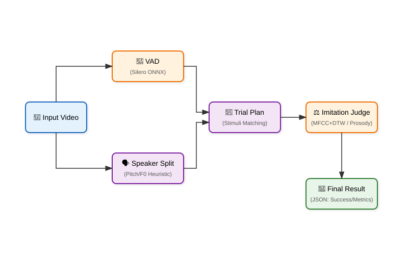

# 🗣️ Speech Imitation Service (발화 모방 평가)
> **Multi-Stage Inference Pipeline**

부모(성인)가 특정 단어/구(자극)를 말했을 때, 아이가 이를 **따라 말했는지(반응)** 를 오디오 기반으로 매칭하고, **유사도(MFCC+DTW)** 및 **운율(Prosody) 이상 여부**를 함께 산출하는 **추론 파이프라인**입니다.

- ✅ **학습(Training) 없음**: 여러 구성요소(모델/알고리즘)를 **순차 실행**하여 결과를 만듭니다.
- ✅ **타깃**: 12~23개월 (월령 밴드에 따라 자극 세트가 달라짐)
- ✅ **입력**: 동영상(`mp4/mov/avi/...`) (내부에서 FFmpeg로 오디오 추출 → 16kHz mono)
- ✅ **출력**: JSON (trial별 성공/실패, latency, similarity, prosody 지표, ADOS 파생 점수)

> [!WARNING]
> 이 프로젝트는 **연구/개발 목적**의 베이스라인입니다. 의료 진단/치료 결정을 위한 도구로 사용하려면 별도의 검증/인허가/품질관리 체계가 필요합니다.

---

## 🔄 Overall Structure



---

## 📦 What this repo does

이 레포는 **"부모의 자극(Stimulus)에 아이가 적절히 반응(Response)했는가?"** 를 판단하기 위해,

1. **VAD**: 오디오에서 말소리 구간을 찾고
2. **Speaker Split**: 피치(F0) 기반으로 **성인(자극)** 과 **아이(반응)** 화자를 분리한 뒤
3. **Trial Plan**: 월령별 자극 목록과 매칭하여 시도(Trial) 구조를 만들고
4. **Imitation Judge**: 자극-반응 쌍의 **유사도(DTW)** 와 **운율**을 분석하여
5. **Result**: 최종 성공 여부와 ADOS 파생 지표를 산출합니다.

---

## ⚡ Quickstart

### Prerequisites
- Python **3.11** 권장
- **FFmpeg** 필수 (PATH에 `ffmpeg`가 있어야 함)
- (선택) `praat-parselmouth`: Prosody(지터/쉬머 등) 분석에 필요

### Local (Conda)

#### 1) 환경 구성
```bash
# Conda 환경 생성 (Python 3.11)
conda create -n speech_imitation python=3.11 -y
conda activate speech_imitation

# ffmpeg 설치 (conda-forge 권장)
conda install -c conda-forge ffmpeg

# (권장) CPU-only PyTorch
pip install --no-cache-dir torch torchaudio --index-url https://download.pytorch.org/whl/cpu

# 의존성 설치
pip install -r requirements.txt
```

#### 2) 실행 (CLI)
```bash
python -m app.main --video /path/to/video.mp4 --age-months 18
```

✅ **성공 기준**: 콘솔에 JSON 결과가 출력되고, 에러 없이 종료되면 정상입니다.
(`SAVE_WAV_CLIPS=True` 설정 시 `./debug_output/`에 파형 클립 생성)

### Docker

RabbitMQ 워커 모드로 실행하려면 Docker Compose를 사용합니다.

```bash
# .env 설정 (예제 복사)
cp .env.example .env

# 실행
docker compose up --build
```
- RabbitMQ UI: `http://localhost:15672` (guest/guest)

> **참고**: 포트(15672)와 기본 계정(guest)은 `docker-compose.yml` 파일 내 `rabbitmq` 서비스 설정에서 변경할 수 있습니다.

---

## 🐇 RabbitMQ Worker

FastAPI가 아닌 **비동기 파이프라인**으로 연동하려면 `app/worker.py`를 사용합니다.

### Run worker
```bash
python -m app.worker
```

### Queue Config
`app/config.py`의 기본값을 따릅니다.
- **Input Queue**: `analysis.req.task2`
- **Output Queue**: `analysis.resp`
- **Host**: `rabbitmq` (Dcoker/Compose 내부) 또는 `localhost` (로컬 실행 시)

### Input Message (Task)
워커는 `s3Uri` 필드를 통해 비디오를 다운로드합니다(Presigned URL 권장).

```json
{
  "examId": "test-exam-001",
  "videoId": "test-video-001",
  "videoType": "SPEECH_IMITATION",
  "childName": "아무개",
  "ageMonths": 18,
  "s3Uri": "https://bucket.s3.ap-northeast-2.amazonaws.com/Key?Signature=..."
}
```

### Output Message (Result)
분석 완료 후 Output Queue로 발행되는 메시지입니다.

```json
{
  "examId": "test-exam-001",
  "videoId": "test-video-001",
  "videoType": "SPEECH_IMITATION",
  "analyzedAt": "2026-02-14T12:34:56+09:00",
  "status": "SUCCESS",
  "metrics": {
    "summary": {"total_reps": 5, "success_reps": 2},
    "per_trial": [
      {
        "trial_index": 1,
        "stimulus_text": "엄마",
        "repetitions": [
          {"rep_index": 1, "success": true, "latency_s": 0.5, "similarity": 0.72}
        ]
      }
    ],
    "ADOS": {"A3": 1, "B18": true}
  }
}

> **참고**: `repetitions` 리스트의 길이는 `REPETITIONS_PER_TRIAL` 설정(기본값 1)에 따릅니다. 설정을 변경하면 한 자극에 대해 여러 번의 시도를 포함할 수 있습니다.
```

---

## 🧩 Models (Inventory)

> 이 파이프라인은 단일 딥러닝 모델이 아니라, 아래 컴포넌트들의 조합으로 동작합니다.

| Component | Role | Implementation | Path | Notes |
|---|---|---|---|---|
| **VAD** | 발화 구간 검출 | Silero VAD v4 (ONNX) | `app/models/vad.py` | 로드 실패 시 Energy 기반 fallback |
| **Speaker Split** | 화자 분리 (성인/아이) | Pitch(F0) Heuristic | `app/models/speaker_splitter.py` | Parentese(높은 톤) 처리가 핵심 |
| **Trial Plan** | 자극-반응 슬롯 계획 | Rule-based | `app/pipeline/stages/trial_plan_stage.py` | 월령별 단어 목록 매칭 |
| **Imitation Judge** | 유사도/운율 평가 | MFCC + DTW | `app/models/imitation_similarity.py` | `DTW_RADIUS`로 속도 최적화 |

---

## ⚙️ Configuration & Tuning

설정은 `app/config.py`에서 관리하며, `.env` 환경 변수로 오버라이드 가능합니다.

| Parameter | Meaning | Default | Impact |
|---|---|---|---|
| `VAD_THRESHOLD` | 음성 감지 민감도 | 0.5 | 낮으면 잡음(FP) 증가, 높으면 발화 놓침(FN) |
| `PITCH_CHILD_HZ_THRESHOLD` | 아이 목소리 피치 기준 | 300Hz | 이보다 높으면 아이, 낮으면 성인으로 분류 |
| `ENABLE_DYNAMIC_THRESHOLD` | 동적 피치 임계값 | False | True 시, 영상 내 피치 분포(K-means)로 기준 자동 조절 |
| `DTW_RADIUS` | 유사도 검색 범위 | 30 | 클수록 정확하지만 연산 비용 급증 |
| `SIMILARITY_THRESHOLD` | 모방 인정 유사도 | 0.65 | 이 값 이상이어야 성공(Success)으로 판정 |
| `SAVE_WAV_CLIPS` | 디버그용 오디오 저장 | False | True 시 `DEBUG_OUT_DIR`에 wav 파일 저장 |

---

## 📄 Outputs (Schema)

최종 결과(`context.to_result()`)는 JSON 형태입니다.

```json
{
  "task_type": "SPEECH_IMITATION",
  "metrics": {
    "summary": {
      "total_reps": 5,
      "success_reps": 2,
      "success_trials": 2
    },
    "ADOS": {
      "A3": 1,
      "B18": true
    },
    "per_trial": [
      {
        "trial_index": 1,
        "stimulus_text": "엄마",
        "repetitions": [
          {
            "rep_index": 1,
            "response_detected": true,
            "latency_s": 1.2,
            "success": true,
            "similarity": 0.41
          }
        ]
      }
    ]
  }
}

> **참고**: `repetitions` 배열의 길이는 `config.REPETITIONS_PER_TRIAL`(기본값 1) 설정에 따라 달라집니다.
```

---

## 🐞 Debugging & Observability

### 1) 오디오 매칭 확인
`SAVE_WAV_CLIPS=True`로 설정하면 `./debug_output/` 폴더에 다음 파일들이 생성됩니다.
- `trialXX_repYY_OK_stim.wav`: 분리된 성인 자극
- `trialXX_repYY_OK_resp.wav`: 분리된 아이 반응
이들을 직접 들어보며 화자 분리와 구간 검출이 올바른지 확인할 수 있습니다.

### 2) 화자 분리 튜닝
"엄마"의 톤이 너무 높거나(Parentese), 아이가 너무 낮게 말하면 분리가 실패할 수 있습니다.
- `ENABLE_DYNAMIC_THRESHOLD=True`를 켜서 동적 임계값을 시도해보세요.
- 그래도 안 되면 `PITCH_CHILD_HZ_THRESHOLD`를 수동으로 조절해야 합니다.

### 3) Visualization
파이프라인 마지막 단계에서 `<input_video>_debug_kr.mp4` 영상을 생성할 수 있습니다. (자막/오버레이 포함)

---

## 📂 Project structure

```text
speech-imitation/
├─ app/
│  ├─ main.py                     # CLI Entrypoint (로컬 디버그용)
│  ├─ worker.py                   # RabbitMQ Consumer (프로덕션용)
│  ├─ config.py                   # 설정 관리 (Pydantic Settings)
│  ├─ models/                     # 핵심 알고리즘 & 모델
│  │  ├─ vad.py                   # Silero VAD Wrapper
│  │  ├─ speaker_splitter.py      # Pitch 기반 화자 분리 로직
│  │  └─ imitation_similarity.py  # MFCC + DTW 유사도 계산
│  ├─ pipeline/                   # 추론 파이프라인
│  │  ├─ orchestrator.py          # 전체 파이프라인 실행 제어
│  │  ├─ context.py               # 파이프라인 상태/데이터 스키마 관리
│  │  └─ stages/                  # 개별 처리 단계 (Input/VAD/Plan/Judge/Result...)
│  └─ utils/
│     ├─ audio.py                 # FFmpeg 오디오 로드/저장 유틸
│     └─ logger.py                # 로깅 설정
├─ assets/                        # 모델 파일 (.onnx 등)
├─ docs/                          # 기술 문서 및 이미지
├─ scripts/                       # 벤치마크/유틸리티 스크립트
└─ tests/                         # Unit Tests
```

---

## Tests

```bash
# 전체 테스트
pytest -q

# 특정 테스트
pytest tests/test_vad.py
```

---

## 🤝 Contributing

- 버그/개선 제안은 Issue로 남겨주세요.
- 코드 변경 시 `pytest` 통과를 확인해주세요.
- 주요 알고리즘 변경 시 `docs/analysis_report.md` 업데이트를 권장합니다.

---

## 📄 License

현재 이 프로젝트에는 라이선스 파일(`LICENSE`)이 포함되어 있지 않습니다.
별도의 라이선스 고지가 없는 한, 기본적으로 저작권법의 보호를 받습니다.
