

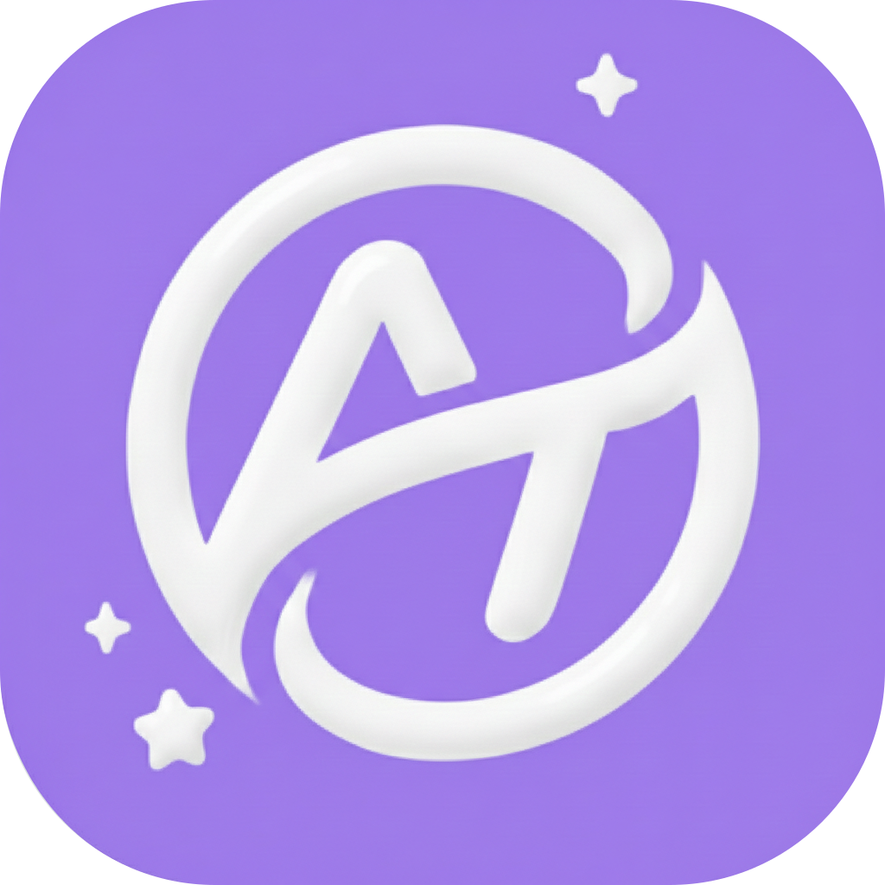

# AITIME

### 자폐 진단 디지털의료기기 
> 12-23개월 영유아와 부모가, 가정 내에서 수행하는 표준화된 4가지 과제를, AI가 채점하여, 소아과 의사의 초진 면담/ 관찰 과정을 대체하는, 디지털 의료기기입니다.

 

---

 

# ✨ Why AITIME?

자폐 진단은 짧은 시간 동안  
다양한 행동 신호를 종합해 판단해야 하는 과정입니다.

AITIME은 그 관찰 과정을  
**AI 기반 정량 데이터**로 변환합니다.

- 반응 시간(ms)
- 모방 정확도
- 시선 지속 시간
- 음성 반응 여부
- 행동 성공률

의사는 더 이상 기억에 의존하지 않습니다.  
이미 데이터가 정리되어 있습니다.

---

 

# 🧠 System Architecture

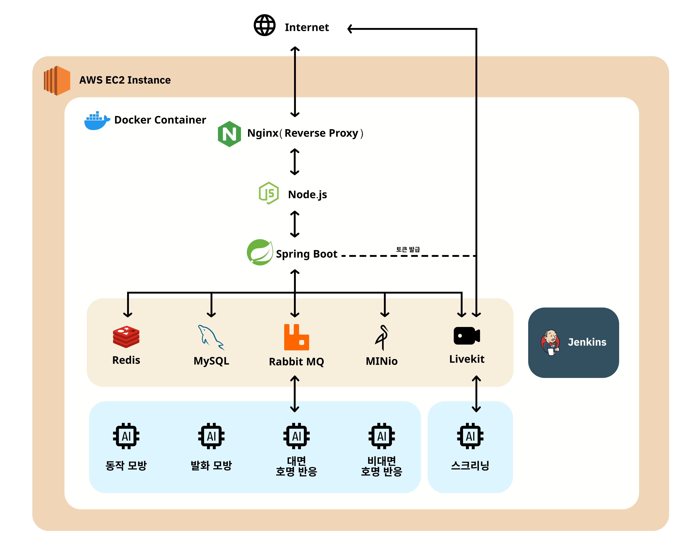

  
<b>📌 Mermaid로 자세히 보기 (Click)</b>

  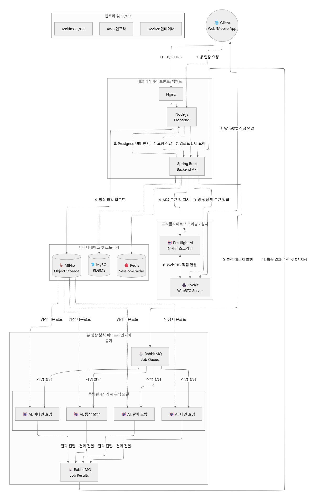

  

---

# 🎥 Demo Experience

## 1. 로그인

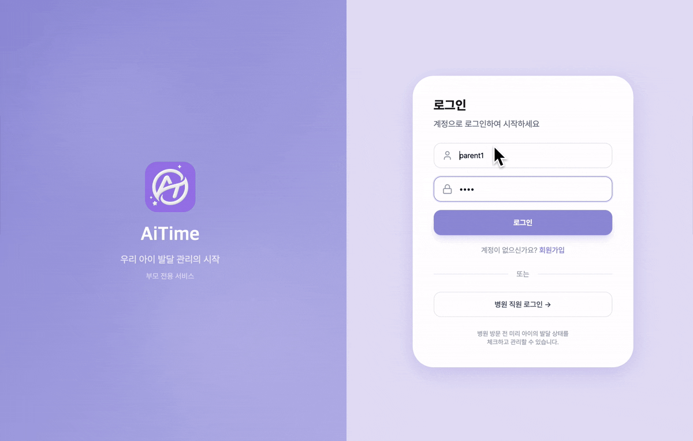

---

## 2. 자녀 선택

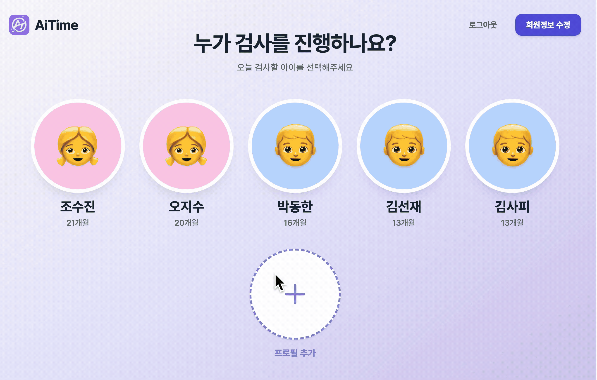

---

## 3. 자녀 추가

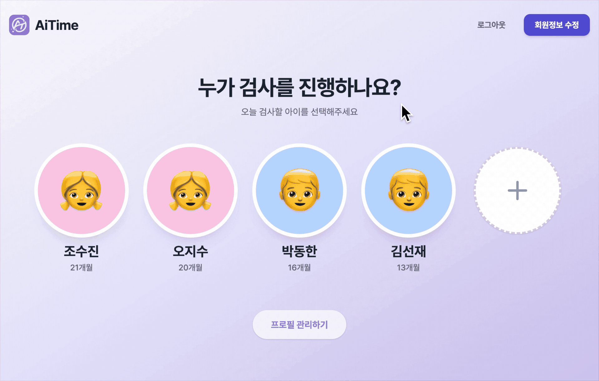

---

## 4. 자녀 초대코드 등록

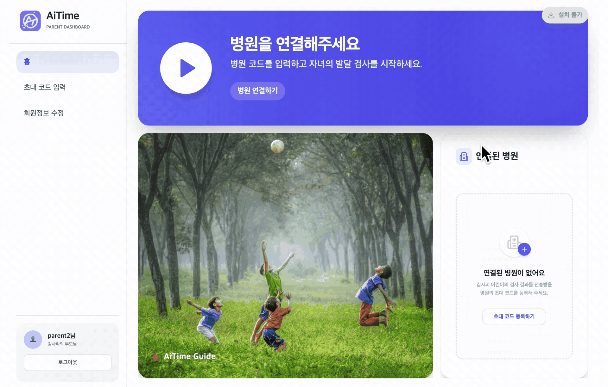

---

## 5. 검사 사전 동의

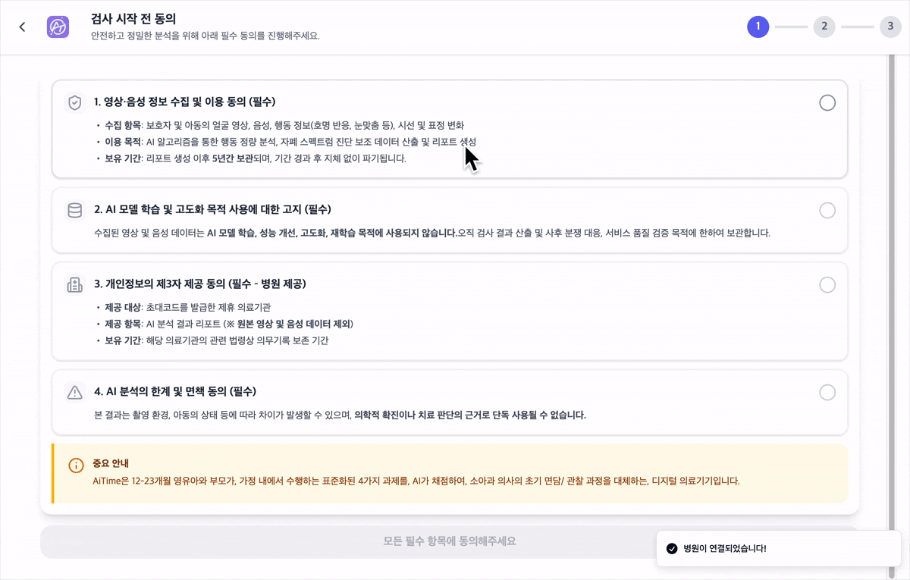

---

## 6. 동작 모방

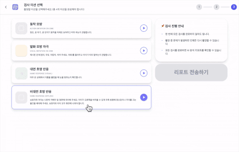

---

## 7. 발화 모방

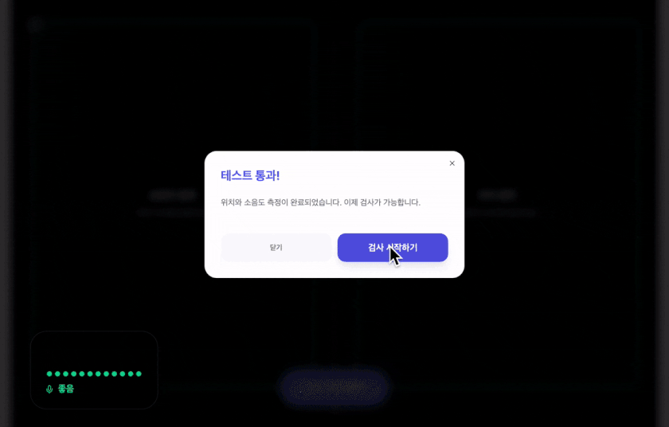

---

## 8. 대면 호명

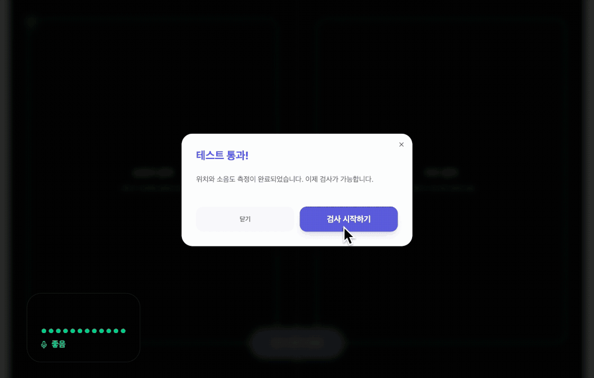

---

## 9. 비대면 호명

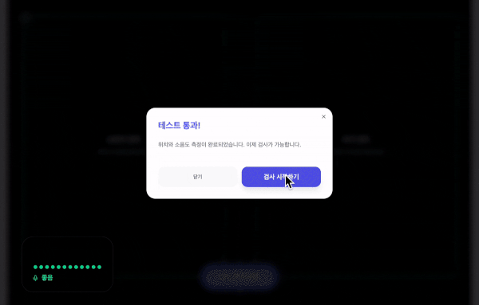

---

## 10. 검사 영상 조회

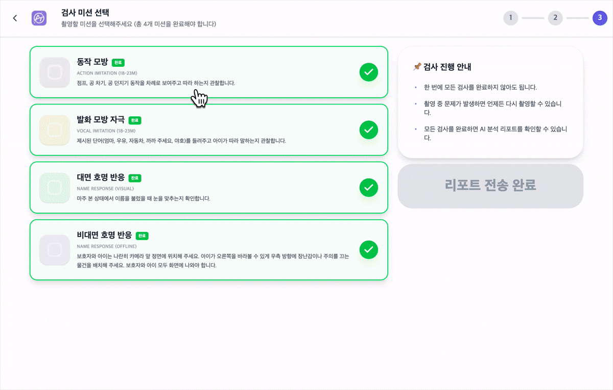

---

## 11. 검사 제출

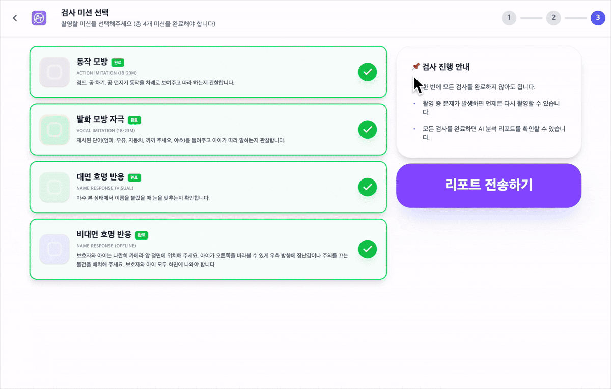

---

## 12. 의사 환자 조회

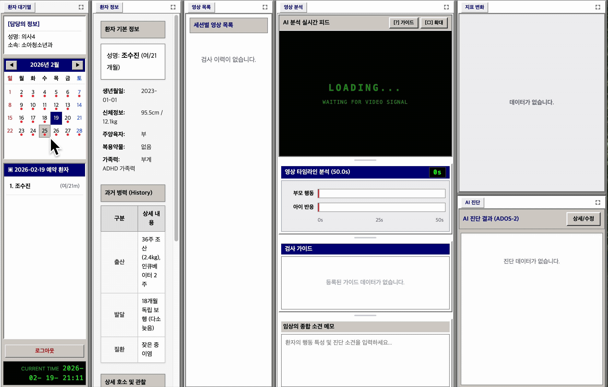

---

## 13. 의사 차트 확인

---

## 14. 타임스탬프 선택

---

## 15. 진단 결과 추가

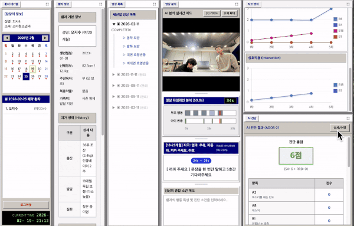

---

## 16. 접수처 로그인

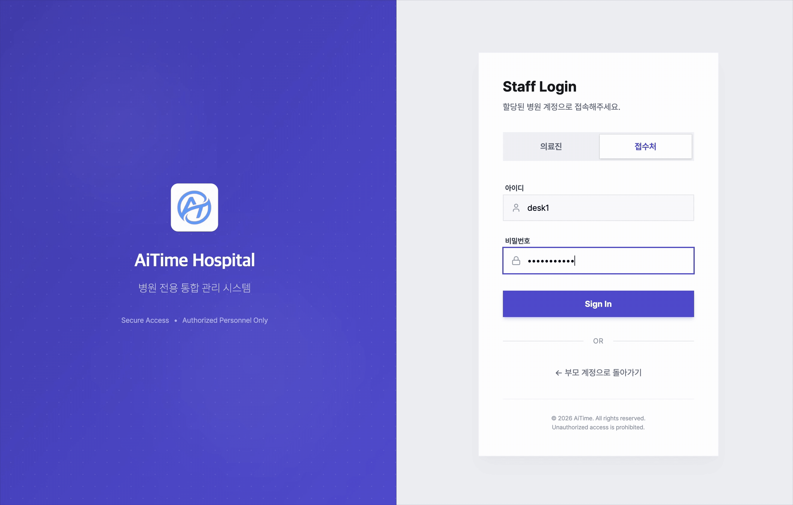

---

## 17. 접수처 초대코드 발급

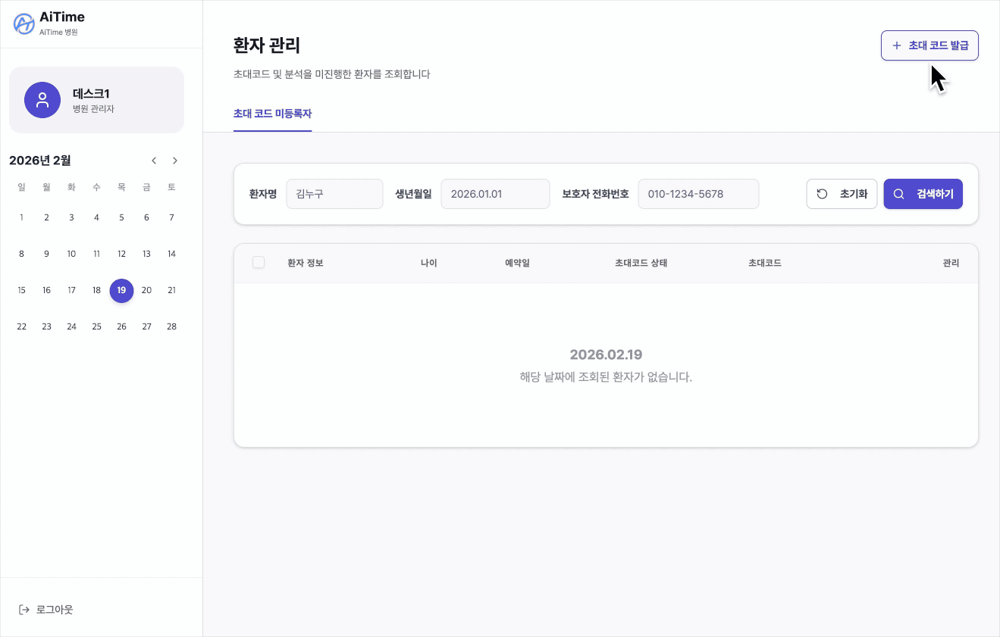

 

# 🏗 Tech Stack

### Frontend
- React
- TypeScript
- Zustand
- TanStack Query
- TailwindCSS
- Vite

### Backend
- Spring Boot 3
- Spring Security
- JWT
- JPA
- Redis
- RabbitMQ
- WebSocket(Livekit)

### AI
- PyTorch
- OpenCV
- RT-DETR
- ViTPose
- Faster-Whisper
- Pyannote
- DTW 기반 행동 정렬

### Infra
- AWS EC2
- Docker / Docker Compose
- Nginx Reverse Proxy
- Jenkins CD

---

 

# 👥 Team

<table>
<tr>

<td align="center" width="200">

 

<b>조수진</b>  
PM / Infra / BE

 
<a href="https://github.com/dobby0628">GitHub →</a>

</td>

<td align="center" width="200">

 

<b>김효석</b>  
UI/UX / FE

 
<a href="https://github.com/hyoseok8948">GitHub →</a>

</td>

<td align="center" width="200">

 

<b>나정현</b>  
AI

 
<a href="https://github.com/najung-h">GitHub →</a>

</td>

</tr>

<tr>

<td align="center">

 

<b>박동한</b>  
AI

 
<a href="http://github.com/DonghanPark">GitHub →</a>

</td>

<td align="center">

 

<b>박윤영</b>  
Backend / DB  

 
<a href="https://github.com/pyy2114">GitHub →</a>

</td>

<td align="center">

 

<b>오지수</b>  
UI/UX / FE

 
<a href="https://github.com/ohjisu320">GitHub →</a>
</a>

</td>

</tr>
</table>

---

 

# 🎯 Impact

- 진단 보조 객관 지표 제공
- 의료진 판단 강화
- 대기 시간 단축 가능성
- 재검토 가능한 디지털 기록 생성
- 확장 가능한 AI 기반 구조

---

## AITIME

의사의 경험을 대체하지 않습니다.  
의사의 판단을 강화합니다.

