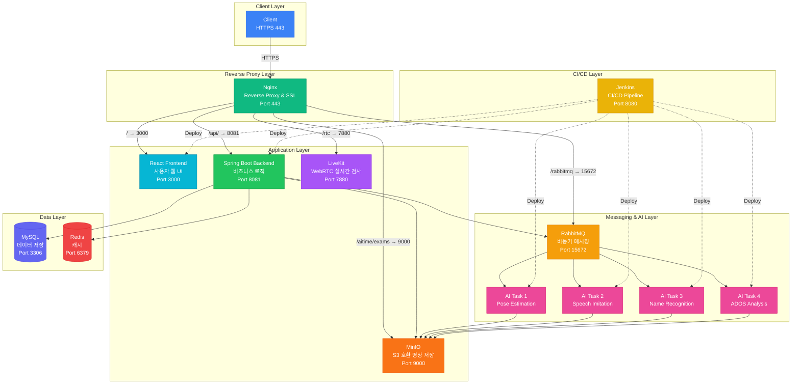

# 포팅 매뉴얼 (Porting Manual)

본 문서는 본 프로젝트를 새로운 서버 환경에 배포하기 위한 포팅 매뉴얼이다.  
Docker 기반 환경을 기준으로 작성되었으며, Ubuntu 22.04 LTS 환경에서 검증되었다.

---

## 0. 아키텍처 개요

### 0-1. 전체 구조 설명

외부 사용자의 요청은 Nginx를 통해 내부 서비스로 프록시된다.

#### 아키텍쳐 다이어그램


### 0-2. 주요 구성 요소

- **Nginx**: Reverse Proxy 및 SSL 종료
- **Spring Boot**: 비즈니스 로직 처리
- **React**: 사용자 웹 UI
- **LiveKit**: WebRTC 기반 실시간 검사
- **MinIO**: 영상 파일 저장 (S3 호환)
- **RabbitMQ**: 비동기 메시징
- **MySQL / Redis**: 데이터 저장 및 캐시

---

## 1. 서버 요구사항 & 사전 설치

### 1-1. EC2 서버 사양

- Instance Type: `t3.large` (예시)
- OS: `Ubuntu 22.04 LTS`
- Storage: `50GB gp3` (예시)

### 1-2. 필수 패키지

- Docker / Docker Compose
- Nginx
- UFW (방화벽)

---

## 2. 네트워크 / 방화벽 설정

### 2-1. UFW 인바운드 포트

| 포트 | 프로토콜 | 용도 |
|------|---------|------|
| 22 | TCP | SSH |
| 80 | TCP | HTTP |
| 443 | TCP | HTTPS |
| 8099 | TCP | RabbitMQ Management |
| 8020 | TCP | LiveKit TURN |
| 41000 | UDP | LiveKit TURN |
| 50000-51000 | UDP | WebRTC Media |

### 2-2. UFW 설정 명령어

```bash
sudo ufw default deny incoming
sudo ufw default allow outgoing

sudo ufw allow 22/tcp
sudo ufw allow 80/tcp
sudo ufw allow 443/tcp
sudo ufw allow 8099/tcp
sudo ufw allow 8020/tcp
sudo ufw allow 41000/udp
sudo ufw allow 50000:51000/udp

sudo ufw --force enable
sudo ufw status verbose
```

### 2-3. AWS 보안그룹

- UFW와 동일한 포트를 반드시 AWS 보안그룹에도 개방해야 함
- 둘 중 하나라도 막혀 있으면 서비스 접근 불가

---

## 3. Nginx 설정

### 3-1. 역할

- 경로 기반 Reverse Proxy
- WebSocket(/rtc) 지원
- MinIO Presigned URL CORS 처리
- HTTPS 적용 (Certbot)

### 3-2. 설정 적용

```bash
sudo nginx -t
sudo systemctl reload nginx
```

---

## 4. 소스 받기 & 디렉터리 구조

```bash
cd /home/ubuntu/src
git clone https://lab.ssafy.com/s14-webmobile1-sub1/S14P11A501.git
cd S14P11A501
```

### 디렉터리 개요

- `/docker`: docker-compose 파일
- `/BE`: Spring Backend
- `/FE`: React Frontend
- `/AI`: AI 서비스

---

## 5. Docker 공통 리소스 준비

### 5-1. Docker Network 생성

```bash
docker network create cmn-network || true
```

### 5-2. Docker Volume 생성

```bash
docker volume create mysql_data || true
docker volume create redis_data || true
docker volume create jenkins_home || true
```

---

## 6. 환경변수(.env) / 시크릿 파일

### 6-1. .env 생성

```bash
cd docker
cp .env.example .env
```

### 6-2. 반드시 수정해야 하는 항목

- MySQL 비밀번호
- JWT_SECRET (32자 이상)
- MinIO 비밀번호
- CoolSMS API Key / Secret
- LiveKit API Key / Secret
- 서비스 도메인

> ⚠️ .env 파일은 Git에 커밋하지 않는다.

---

## 7. Docker Compose 기동 순서

### ⚠️ 순서 중요

1. 공통 인프라
2. DB / Redis / RabbitMQ
3. Backend
4. AI 서버 (하나씩 빌드 권장)
5. LiveKit
6. Frontend

### 예시

```bash
docker compose -f docker-compose.cmn.yml up -d
docker compose -f docker-compose.db.yml up -d
docker compose -f docker-compose.backend.yml up -d --build
docker compose -f docker-compose.ai1.yml up -d --build
docker compose -f docker-compose.ai2.yml up -d --build
docker compose -f docker-compose.livekit.yml up -d
docker compose -f docker-compose.frontend.yml up -d --build
```

---

## 8. 초기 데이터 / DB Dump 적용

### 8-1. Dump 파일 준비

```bash
unzip aitime.zip
```

### 8-2. MySQL 데이터 적용

```bash
docker exec -i mysql \
  mysql -u root -paitime aitime < aitime.sql
```

---

## 9. 시연 시나리오

### 9-1. 부모 페이지

- 회원가입 (휴대폰 인증)
- 로그인
- 자식 추가

### 9-2. 접수처 페이지

- ID: `desk1`
- PW: `password123!`
- 로그인
- 초대코드 발급
- 초대코드 복사

### 9-3. 검사 진행

- 초대코드 등록
- 검사 페이지 진입
- 사전 안내 영상 시청
- 환경 검사
- 4개 검사 수행
- 리포트 전송

### 9-4. 의사 페이지

- 예약 환아 확인
- 검사 영상 / 타임스탬프 확인
- AI 기반 ADOS 결과 확인

---

## ✅ 포팅 완료 체크리스트

- [ ] .env 설정 완료
- [ ] 방화벽 / 보안그룹 확인
- [ ] Nginx 정상 동작
- [ ] DB 초기 데이터 적용
- [ ] LiveKit 연결 확인
- [ ] 시연 시나리오 정상 동작