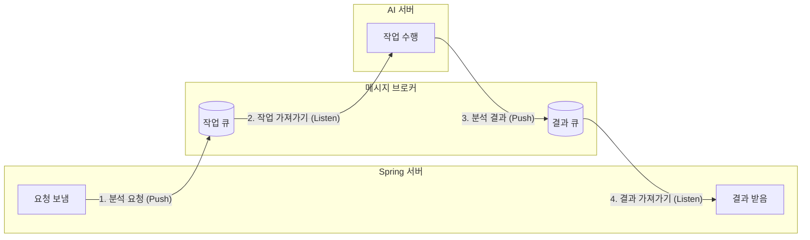

### [ 기타 합의 사항 ]

- AI 분석 실패 시, `FAILED_REASON` 을 넘겨주어야 한다.
  - 그런데, 그것은 어느 노드 단계에서 실패했는지를 통해 간접적으로 표시할 수 있을 것 같다!


### [ 오늘 참고한 논문 ]

김태원. (2025). *AI 기반 비디오 분석을 활용한 아동 인지 및 잡기 패턴 평가 모델 개발* [석사학위논문, 울산대학교 대학원].


### [ TIL ]

1. AI 비디오 분석 로직을 Python 서버에서 처리하고, 메인 웹 서비스인 Spring Boot와 연동하는 과정에서 비동기 처리가 필수적이었다. 

   그 중에서도 RabbitMQ를 도입하면서 단순 단방향이 아닌, 양방향 통신을 위해 큐를 어떻게 구성해야 하는지 정리했다.

   1. RabbitMQ는 기본적으로 단방향 통신이다. 따라서 Spring이 요청을 보내고 Python이 처리한 뒤 다시 Spring이 결과를 받기 위해서는 가는 길(작업 큐)과 오는 길(결과 큐), 총 2개의 큐가 필요하다.
   2. 이 중 작업큐는 파이썬이 리스닝 했다가 백엔드가 작업 넣어두면 데려오는 거고, 결과 큐는 백엔드가 리스닝하다가 파이썬이 분석 결과 넣어두면 데려와서 DB에 넣는 것!



 MQ에는 어떻게 결과 큐를 쌓을 수 있지?

| **특징**        | **Pika (피카)**    | **Celery (셀러리)** | **FastStream (패스트스트림)** |
| --------------- | ------------------ | ------------------- | ----------------------------- |
| **난이도**      | 중 (코드가 긺)     | 상 (설정이 많음)    | **하 (매우 쉬움)**            |
| **안정성**      | 개발자 역량에 달림 | **최고 (검증됨)**   | 높음                          |
| **주요 용도**   | 단순 통신          | 무거운 작업 관리    | 마이크로서비스 통신           |
| **Spring 연동** | 좋음 (Raw JSON)    | 설정 필요           | **아주 좋음 (Raw JSON)**      |

FastStream 써야 겠다.


### [ AI ]

1. 

- AI Hub 데이터를 못 쓰게 되었다.
- 외국 데이터 들은 많지 않다. 
- 이를 어떻게 극복할 것인가!
- 일단은 팀끼리 잘 찍어보고 그 영상을 가지고 결과를 봐야겠다.
- 학습 단계를 빼는 것도 생각을 해봐야할 필요가 있다.
- 일단 굴러가는 코드를 만들고 고도화하는 스프린트/에자일 방식을 따르기로 했지만, 어디까지가 일단 굴러가는 코드인지는 애매하다.

2. 

- [child gaze](https://zenodo.org/records/8252535) 관련 드래프트를 찾았다. 비대면 호명반응에서 쓸 만한 가능성이 보이니 일단 킵. mvp 인 모방 행동부터 우선 잘 설계해야겠다.

3. 

- 내일 코치님 면담하기 전까지 어떤 것을 해갈 것인가.. 에 대한 개인적 목표
  - 12시까지 AI  장표 백 pt 만들어서 건네주기.
  - 내일 오전 == AI 장표 백 pt 제작
  - 점심 먹고 각 노드 어떻게 구성할 것인가. 에 대한 draft 완결시키기.
  - 컨님 미팅이후에는,,, 일단 돌아가는 코드 개발 시작.

4. coco dataset

   ```
   COCO 데이터셋은 이미지와 정답지(Annotation)가 따로 나뉘어 있습니다. 사람 뼈대(Keypoints) 분석을 하려면 아래 3가지 파일을 모두 받아야 합니다.
   
   이미지 파일 (용량이 큽니다):
   
   2017 Train images [118K/18GB] (학습용 이미지)
   
   2017 Val images [5K/1GB] (검증용 이미지)
   
   정답 데이터 (Annotations):
   
   2017 Train/Val annotations [241MB]
   
   이 압축을 풀면 여러 파일이 나오는데, 그중 person_keypoints_train2017.json 파일이 바로 찾으시는 스켈레톤 데이터입니다.
   ```

   

- mlflow.db를 gitignore에 추가해야하나? 이거 확인해보기

---

하단은 노션에 기록한 내용

- 우리 팀은 노션을 참고하고, git에는 기록용으로 더블 업로드함.

- ### 1.

  - 편한 다운로드  |   https://www.kaggle.com/datasets/awsaf49/coco-2017-dataset
  - 공식 홈페이지  |    https://cocodataset.org/#download

  ### 2. MMpose 라이브러리 설치하기로 결정.

  MediaPipe(가볍음), YOLOv8(범용성), OpenPose(원조) 외에 **연구(SOTA, State-of-the-Art) 및 현업**에서 "각 잡고" 쓸 때 사용하는 모델들 싹

  특히 **'부모와 아동'**이라는 2인 상호작용(Multi-person) 환경과, 아동의 **작은 신체**를 감지해야 하는 특성에 맞춰 비교

  ### Pose Estimation 모델 비교 (SOTA급 포함)

  | **구분**            | **AlphaPose**                            | **RTMPose (MMPose)**        | **ViTPose**                       | **HRNet**                 | **MoveNet (Google)**   |
  | ------------------- | ---------------------------------------- | --------------------------- | --------------------------------- | ------------------------- | ---------------------- |
  | **핵심 특징**       | **다인원 추적 최강자**                   | **실시간 + 고성능 균형**    | **정확도 끝판왕 (SOTA)**          | **고해상도 유지**         | **모바일/엣지 최적화** |
  | **방식**            | Top-Down (사람 먼저 찾고 → 관절)         | Top-Down                    | Top-Down (Transformer 기반)       | Top-Down                  | Bottom-Up/Single       |
  | **정확도**          | ⭐⭐⭐⭐☆ (매우 높음)                        | ⭐⭐⭐⭐ (높음)                 | ⭐⭐⭐⭐⭐ (최상)                      | ⭐⭐⭐⭐☆ (아주 높음)         | ⭐⭐⭐ (보통)             |
  | **속도**            | 보통 (실시간은 빡셀 수 있음)             | **매우 빠름**               | 느림 (무거움)                     | 보통                      | **매우 빠름**          |
  | **가림(Occlusion)** | **아주 강함** (부모가 애 가려도 잘 찾음) | 강함                        | 강함                              | 보통                      | 약함                   |
  | **구현 난이도**     | 상 (환경설정 복잡)                       | 중 (MMPose 라이브러리 사용) | 상 (MMPose 사용 권장)             | 중상                      | 하 (TF Hub 사용)       |
  | **추천 상황**       | **정확한 연구용 데이터 분석**            | **실시간 웹 서비스 탑재**   | **속도 무관, 최고 정확도 필요시** | 작은 물체(아기 손) 디테일 | 모바일 앱 구동         |

  - 기술적 결정

    # [Tech Stack] Multi-person Pose Estimation 모델 선정 및 비교 분석

    ## 1. Dataset

    - **COCO 2017 Dataset**
      - 선정 이유: Human Pose Estimation 모델 학습 및 벤치마킹의 표준 데이터셋.
      - 특징: 다양한 환경과 포즈, 다인원(Multi-person) 이미지를 포함하고 있어 모델의 일반화 성능 검증에 적합함.

    ## 2. 라이브러리 및 모델 선정

    ### 선정 결과

    - **Library:** MMPose (OpenMMLab)
    - **Model:** ViTPose (Vision Transformer based Pose Estimation)

    ### 의사결정 과정

    1. **MMPose 채택 이유**
       - **확장성:** PyTorch 기반의 오픈소스 라이브러리로, ViTPose뿐만 아니라 RTMPose, HRNet 등 다양한 SOTA(State-of-the-Art) 모델을 config 파일 수정만으로 쉽게 교체 및 테스트 가능.
       - **검증된 성능:** 학계 및 현업에서 벤치마크용으로 가장 널리 사용되어 레퍼런스가 풍부함.

  - (결론) : `MMPose` 라이브러리를 사용해서 **`ViTPose` 쓸 것.**

    - https://github.com/ViTAE-Transformer/ViTPose

  - mediapipe 안 한 이유는?

    기본적으로 1인(single person) 최적화라, 부모 아이가 겹치는 구도에서 관절 뺏어갈 것 같음.

    실시간성/빠른게 중요하지 않음! 무조건 정확도 우선. 집에서 진료실까지 가는데 최소 10분은 들겠지.

    - 제미나이

      ### 1) Multi-person 처리 방식의 한계

      - **MediaPipe:** 기본적으로 Single-person(셀피 모드 등)에 최적화되어 있다. 다인원 모드를 지원하긴 하지만, Bottom-up 방식 혹은 단순화된 로직으로 인해 사람이 겹치거나 밀집된 상황에서 객체 간 ID가 바뀌거나(ID Switching) 관절이 튀는 현상이 잦다.
      - **MMPose (Top-Down):** 먼저 사람을 탐지(Object Detection)하고, 탐지된 각 사람 영역(BBox) 내에서 관절을 추정한다. 이 방식은 연산량은 많지만 다인원 상황에서 각 객체를 독립적으로 분석하므로 훨씬 안정적이다.

      ### 2) 폐색(Occlusion) 처리 능력

      - 아동 행동 분석(ASD 선별) 특성상, 13-24개월 특성상 부모가 아이를 안거나, 아이의 신체 일부가 가려지는 상황이 필수적으로 발생한다.
      - MediaPipe는 가려진 관절을 예측할 때 정확도가 급격히 떨어지는 경향이 있으나, ViTPose는 어텐션 메커니즘을 통해 가려진 부위도 문맥적으로 유추하는 성능이 뛰어나다.

      ### 3) 연구 목적의 정밀도

      - 현재 프로젝트는 실시간성(Real-time)보다는 ****진단 보조를 위한 '정밀 분석'****이 우선순위다.
      - 모바일 구동을 위해 경량화된 MediaPipe보다는, 서버 사이드에서 조금 느리더라도 정확한 좌표를 뽑아내는 ViTPose가 프로젝트의 목적(미세 행동 패턴 분석)에 부합한다.

  - 3D 가 아닌 2D 모델을 사용하는 이유는?

    # [Decision] 3D Pose Estimation 대신 2D를 선택한 이유

    ## 1. 입력 데이터의 한계 (Monocular Video)

    - **현황:** 분석 대상이 되는 아동 영상은 대부분 일반 스마트폰이나 웹캠으로 촬영된 '단일 시점(Single View)'의 RGB 영상이다.
    - **문제:** 깊이(Depth) 정보가 없는 2D 영상에서 3D 좌표(x, y, z)를 추출하려면 '3D Lifting'이라는 추정 과정을 거쳐야 하는데, 이 과정에서 **Z축(깊이) 추정의 정확도가 현저히 떨어지며 노이즈가 발생**한다.
    - **결론:** 부정확한 3D 좌표를 억지로 만들어 사용하는 것보다, 정확한 2D 좌표를 신뢰하는 것이 데이터 분석에 유리하다.

    ## 2. 분석 목적의 적합성 (Imitation Analysis)

    - **목적:** 아동이 부모의 행동을 '모방'하는지 여부는 절대적인 3D 공간 좌표보다는 **신체 부위 간의 상대적인 각도(Angle)와 움직임의 패턴**이 중요하다.
    - **근거:** 예를 들어 '박수 치기', '손 들기' 같은 동작은 2D 평면에 투영된(Projected) 좌표의 변화만으로도 충분히 패턴 매칭과 유사도 분석(DTW)이 가능하다. 불필요한 차원(Z축)을 추가하여 연산 복잡도를 높일 필요가 없다.

    ## 3. 모델 성능 및 생태계 (SOTA Availability)

    - **성능:** 현재 Computer Vision 학계에서 2D Pose Estimation(예: ViTPose)은 매우 높은 정확도(mAP)를 보여주지만, 3D Pose Estimation은 여전히 폐색(Occlusion)이나 특이 자세에서 에러율이 높다.
    - **데이터셋:** 학습에 사용하기로 한 **COCO Dataset**이 기본적으로 2D Keypoint를 제공하는 표준 데이터셋이다. 3D 모델을 학습시키려면 Human3.6M 같은 별도의 데이터셋이 필요한데, 이는 아동 데이터와는 거리가 멀어 도메인 적합성이 떨어진다.

    ## 4. 요약

    1. **데이터 제약:** 입력 영상이 2D(RGB)이므로 정확한 3D 추론이 불가능.
    2. **목적 달성:** 모방 행동 분석에는 2D 좌표와 각도 정보만으로 충분함.
    3. **신뢰도:** 불안정한 3D 모델보다 검증된 SOTA 2D 모델(ViTPose)의 신뢰도가 훨씬 높음.

  - 관련 블로그

    https://rahites.tistory.com/301