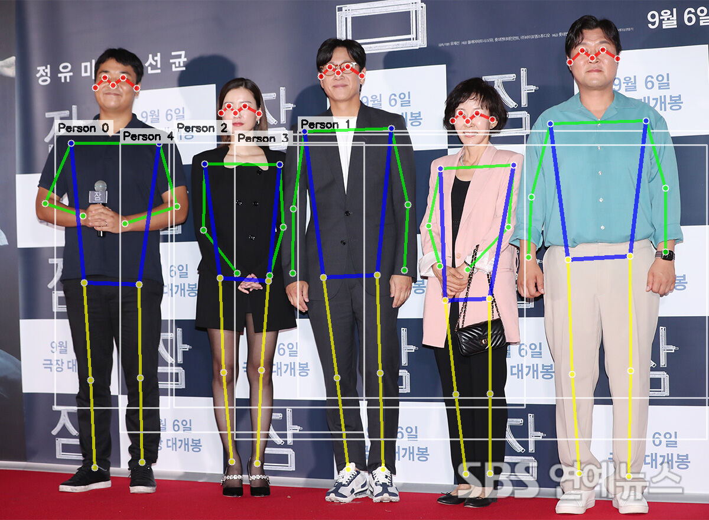

[ 오늘 한 일 ]

```
[ 오전 ]
- 발표 준비
- 발표

[ 오후 ]
- Jira 서브태스크 몇몇 채워넣기
- 모방행동 개발
  - pose_estimation
    - fastapi 디렉토리 세팅해두고, uvicorn으로 배포해서 postman 응답 확인
```


[ 발표 피드백 보관 ]

```
자신감있는 모습과 더불어 딕션이 정확하고 멘트 속도도 적당해서 전체적으로 신뢰감있게 보이는 밢표력이 인상적입니다.
발표에 어울리는 포인트 있는 텍스트와 근거있는 전문가의 피드백 표현 전략이 눈에 띄는거 같습니다.
핵심지표가 명확하게 언급된점은 좋아보이지만 멘트에만 의지한 설명이 짧은 시간 이해되기에는 쉽지 않을것으로 예상됩니다. 각각의 지표에 대한 모션과 설명 장표만으로도 어느정도 이해가 될수 있는 장표 구성이 필요해보입니다. (이 부분에 대한 표현과 기술적 설계에 대한 어필이 1팀의 가장 중요한 포인트가 될것 같습니다)
4컷으로 표현된 기대효과 장표는 매우 효과적이었습니다. 대사가 잘 안보이는 부분에 대해서는 수정도 고려해봅시다
서비스 설명은 너무 잘된것 같습니다. 다만, 서비스를 구현하기 위한 기술적 설계(시도)에 대한 기대를 불러오기 위한 전략이 누락된점은 아쉽습니다.
마지막 전문가 프로필로만 표현된 장표는 앞선 장표와 중복되는 느낌이라 효과적으로 보이지 않았습니다.
전체적으로 잘 준비된 발표인것 같습니다. IT프로젝트인 만큼 서비스 자체에 대한 구체적인 설계 내용이 없어 보이는 점이 평가자들이 짧은시간 이해를 가져가기 어렵게 만드는 요소로 보입니다.
전문가 의견에만 의지한 느낌이 많이 들어 구체적 구현방향이 쉽게 예상되지 않는 리스크도 있었던거 같습니다. 빠른 프로토타입 도출을 통해 개념적인 서비스의 보다 디테일한 구체화를 가져가는 형태로 계획을 세웠으면 좋겠습니다.
```


[ 오늘의 성과 ]




[ KPT 회고 ]

K
- 개발할 수 있는 시간에는 최대한 개발해두기
- 일정을 지키기 위해 mvp 목표를 타협하기. 고도화보다는 팀을 위한 완성
- 그럼에도 불구하고, 미래의 나와 팀을 위해, 이해하지 못하고 검토하지 못한 코드는 올리지 말자.
---
P
- 어제 1시에 잤더니.. 5시반 기상, 역삼 7시 반 도착.
- 작업 예상 시간에 대한 감이 아직 잘 잡히지 않는다. 분명 7시반에 갈 계획이었는데 1-2시간씩 밀리게 된다.
- 너무 더듬어서 발표 역량에 대한 아쉬움이 있다. 질문이 이해가 안 되는 경우는 처음이라 당황했는데. 내 설명이 추상적이어서 이러한 상황이 나왔을 거라고 생각이 든다.
- 구현과 고도화 중에 우선순위를 항상 되뇌이자. 
---
T
- 내일은 잘 자야겠다.